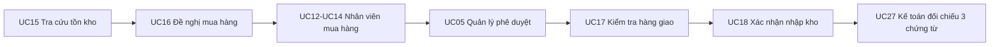

# Hướng đi sau phân hệ Quản lý và thiết kế actor tiếp theo

## 1. Kết luận từ hai tài liệu nghiệp vụ

- Hệ thống có đúng 5 actor: Quản lý, Nhân viên mua hàng, Thủ kho, Thu ngân và Kế toán.
- `admin` là tên đăng nhập của actor **Quản lý**, không phải actor thứ sáu.
- Quản lý chỉ thực hiện UC01–UC10. Không gán toàn bộ 29 use case cho Quản lý.
- Chức vụ của nhân viên và vai trò của tài khoản phải cùng một actor.
- `TenNV` là tên người thật hoặc tên mẫu hợp lệ; không dùng chức vụ làm tên như “Nguyễn Văn Quản Lý”.
- Kế toán chỉ có UC01 và UC27–UC29; UC09 là bước Quản lý phê duyệt Phiếu chi.

## 2. Thứ tự hoàn thiện phân hệ Quản lý

1. UC01–UC03 và phần nhân viên của UC04: đăng nhập, nhân viên, tài khoản, phân quyền, nhật ký.
2. Phần dữ liệu dùng chung còn lại của UC04: danh mục, sản phẩm và khuyến mãi.
3. UC05–UC09: năm hàng đợi phê duyệt nghiệp vụ.
4. UC10: báo cáo tổng hợp doanh thu, giá vốn, lợi nhuận gộp, kho và công nợ.

Không nên triển khai báo cáo trước khi các luồng kho, mua hàng và bán hàng đã tạo đủ dữ liệu nguồn.

## 3. Actor nên làm tiếp: Nhân viên kho/Thủ kho

Thủ kho là actor phù hợp nhất để làm tiếp vì UC15–UC16 khởi tạo nhu cầu mua hàng; kết quả của UC17–UC18 lại cung cấp Phiếu nhập cho Kế toán đối chiếu. Làm actor này trước giúp hình thành chuỗi nghiệp vụ xuyên suốt thay vì tạo các màn hình rời rạc.

## 4. Menu đề xuất cho Thủ kho

- Tổng quan kho.
- Tồn kho và cảnh báo mức tối thiểu — UC15.
- Phiếu đề nghị mua hàng — UC16.
- Tiếp nhận và kiểm tra hàng — UC17.
- Phiếu nhập kho — UC18.
- Phiếu xuất kho thủ công — UC19.
- Kiểm kê và chênh lệch — UC20.
- Kiểm tra hàng khách đổi trả — UC21.

## 5. Thiết kế các màn hình theo giai đoạn

### Giai đoạn 1 — UC15 và UC16

**Màn Tồn kho**

- Thẻ số liệu: tổng mã hàng, sắp hết, hết hàng, đã đặt nhưng chưa nhận.
- Bộ lọc: mã/tên/mã vạch, danh mục, trạng thái tồn.
- Bảng: sản phẩm, tồn hệ thống, tồn tối thiểu, đã đặt, khả dụng và cảnh báo.
- Nút “Tạo đề nghị mua” chỉ bật cho sản phẩm chạm mức tồn tối thiểu.

**Màn Phiếu đề nghị mua**

- Danh sách theo trạng thái: Nháp → Đã gửi → Đang xử lý → Trả lại → Đã lập đơn.
- Phiếu nháp cho phép thêm, sửa, xóa dòng hàng.
- Khi gửi phiếu phải khóa nội dung; chỉ Nhân viên mua hàng mới tiếp nhận hoặc trả lại.
- Nếu tồn thực tế lệch tồn hệ thống, chuyển sang UC20 thay vì sửa thẳng số tồn.

### Giai đoạn 2 — UC17 và UC18

**Màn Tiếp nhận hàng**

- Chỉ chọn Đơn mua hàng đã duyệt.
- Mỗi dòng nhập `SoLuongGiao`, `SoLuongChapNhan`, `SoLuongTuChoi`, tình trạng và lý do.
- Chặn lưu nếu `SoLuongGiao != SoLuongChapNhan + SoLuongTuChoi`.
- Hiển thị số lượng còn thiếu để Nhân viên mua hàng theo dõi giao bù.

**Màn Phiếu nhập kho**

- Sinh từ kết quả kiểm tra hàng.
- Chỉ dùng số lượng chấp nhận để tính thành tiền và cộng tồn.
- Xác nhận Phiếu nhập, cập nhật `TonKho` và tạo `GiaoDichKho` trong cùng một transaction.
- Phiếu đã xác nhận không được sửa.

### Giai đoạn 3 — UC19 đến UC21

- UC19: Nháp → Chờ duyệt → Đã duyệt/Từ chối → Đã xuất; chỉ giảm tồn ở bước xác nhận xuất.
- UC20: Đang kiểm kê → Hoàn thành hoặc Chờ duyệt điều chỉnh → Đã duyệt/Từ chối.
- UC21: Thủ kho chỉ ghi kết quả kiểm tra hàng trả; Quản lý mới phê duyệt đổi trả.

## 6. Kết quả đã triển khai cho giai đoạn đầu

- Thủ kho đã có Tổng quan kho, Tồn kho và cảnh báo, Đề nghị mua hàng.
- Có thể tra cứu theo mã, tên và mã vạch; lọc mặt hàng ở hoặc dưới tồn tối thiểu.
- Đề nghị mua hàng hỗ trợ lưu nháp, sửa toàn bộ dòng hàng, gửi và hủy khi chưa gửi.
- Mỗi dòng lưu riêng tồn hệ thống và tồn kiểm đếm thực tế. Chênh lệch không tự động sửa `TonKho`.
- Đề nghị được gửi thẳng sang Nhân viên mua hàng, không đi qua hàng đợi phê duyệt của Quản lý.
- Nhân viên mua hàng đã có hộp “Đề nghị từ kho” để nhìn thấy hồ sơ đã gửi.
- API kiểm tra quyền trực tiếp bằng `VaiTro_ChucNang`, không chỉ dựa vào việc ẩn menu.
- Thao tác tạo, cập nhật, gửi và hủy đều ghi `NhatKy`.

Các API đã có:

- `GET /api/warehouse/dashboard`
- `GET /api/warehouse/inventory?search=&lowOnly=`
- `GET /api/warehouse/purchase-requests`
- `GET /api/warehouse/purchase-requests/:id`
- `POST /api/warehouse/purchase-requests`
- `PUT /api/warehouse/purchase-requests/:id`
- `POST /api/warehouse/purchase-requests/:id/submit`
- `POST /api/warehouse/purchase-requests/:id/cancel`
- `GET /api/purchasing/purchase-requests`
- `GET /api/purchasing/purchase-requests/:id`

Tất cả API phải xác thực token, kiểm tra quyền UC tương ứng và ghi `NhatKy` cho thao tác làm thay đổi dữ liệu.

## 7. Điều kiện hoàn thành actor Thủ kho

- Menu chỉ hiện đúng UC15–UC21.
- Không thể truy cập API ngoài quyền bằng cách gọi trực tiếp URL.
- Không cập nhật tồn khi phiếu còn nháp, chờ duyệt hoặc bị từ chối.
- Mọi cập nhật Phiếu nhập/tồn kho/giao dịch kho có transaction và rollback khi lỗi.
- Có kiểm thử luồng chuẩn, dữ liệu sai, tồn không đủ, gửi trùng và xác nhận trùng.
- Nhật ký ghi rõ người thao tác, bảng, mã bản ghi, hành động và thời gian.

## 8. Phần nên làm tiếp theo theo đúng chuỗi nghiệp vụ

Không nên làm tiếp ngay Phiếu nhập kho của Thủ kho, vì UC17–UC18 cần một Đơn mua hàng đã được Quản lý duyệt. Phần tiếp theo phải chuyển sang Nhân viên mua hàng, sau đó quay lại Thủ kho.

### Bước A — Hoàn thiện tiếp nhận đề nghị của Nhân viên mua hàng (UC12)

1. Hàng đợi chỉ chứa đề nghị đã gửi; không lộ bản nháp của Thủ kho.
2. Nhân viên mua hàng mở chi tiết tồn hệ thống, tồn thực tế, định mức và số lượng đề nghị.
3. Chọn “Tiếp nhận xử lý” để chuyển `Đã gửi → Đang xử lý`, ghi người và thời điểm tiếp nhận.
4. Nếu dữ liệu chưa hợp lệ, chọn “Yêu cầu bổ sung”, bắt buộc nhập lý do; Thủ kho được sửa rồi gửi lại.
5. Không cho hai nhân viên tiếp nhận cùng một đề nghị; cập nhật trạng thái có khóa/transaction.

### Bước B — Quản lý nhà cung cấp (UC11)

1. Danh sách và hồ sơ nhà cung cấp: mã, tên, liên hệ, địa chỉ, mã số thuế, trạng thái.
2. Điều khoản thương mại theo nhà cung cấp: số ngày thanh toán, thời gian giao dự kiến, mặt hàng có thể cung ứng.
3. Kiểm tra trùng mã số thuế, số điện thoại và tên; nhà cung cấp ngừng hoạt động không được chọn vào đơn mới.
4. Lịch sử giao dịch để hỗ trợ chọn nhà cung cấp, nhưng chưa làm chức năng chấm điểm ngoài phạm vi tài liệu.

### Bước C — Lập Đơn mua hàng từ đề nghị (UC13)

1. Chỉ lập từ đề nghị `Đang xử lý`; không tạo đơn mua rời không có nguồn.
2. Chọn nhà cung cấp, ngày giao dự kiến, điều khoản và số ngày thanh toán.
3. Sao chép các dòng từ `ChiTietDeNghi` sang `ChiTietDonMua`; cho phép điều chỉnh số lượng có ghi lý do.
4. Tính tiền từng dòng và tổng đơn ở máy chủ, không tin số tiền gửi từ giao diện.
5. Lưu nháp, sửa, xóa dòng khi còn nháp; gửi duyệt làm khóa nội dung.
6. Khi lập đơn thành công, đề nghị chuyển `Đã lập đơn`; không được lập trùng đơn cho cùng đề nghị.

### Bước D — Quản lý phê duyệt Đơn mua hàng (UC05)

1. Đơn mua hàng mới xuất hiện trong Trung tâm phê duyệt của Quản lý.
2. Quản lý xem đề nghị nguồn, nhà cung cấp, số lượng, đơn giá, tổng tiền và ngày giao.
3. Phê duyệt hoặc từ chối; từ chối bắt buộc ghi lý do.
4. Chỉ đơn đã duyệt mới được gửi nhà cung cấp và chuyển sang theo dõi giao hàng.

### Bước E — Theo dõi giao hàng (UC14), rồi quay lại Thủ kho (UC17–UC18)

1. Nhân viên mua hàng theo dõi đơn đã duyệt: chờ giao, giao một phần, giao đủ, quá hạn hoặc hủy.
2. Khi hàng đến, Thủ kho chọn đúng Đơn mua đã duyệt để kiểm tra; không nhập hàng không có đơn nguồn.
3. Ghi số giao, số chấp nhận, số từ chối và lý do. Phải thỏa `giao = chấp nhận + từ chối`.
4. Phiếu nhập chỉ lấy số chấp nhận; xác nhận nhập, tăng tồn và tạo `GiaoDichKho` trong cùng transaction.
5. Giao thiếu cập nhật số còn thiếu để Nhân viên mua hàng tiếp tục theo dõi giao bù.

### Bước F — Chuyển chứng từ sang Kế toán (UC27–UC28)

1. Khi có Đơn mua đã duyệt + Phiếu nhập đã xác nhận + hóa đơn nhà cung cấp, Kế toán thực hiện đối chiếu ba chứng từ.
2. Chỉ hồ sơ khớp/được xử lý chênh lệch mới ghi nhận công nợ.
3. Đến hạn, Kế toán lập đề nghị/Phiếu chi; Quản lý phê duyệt theo UC09 rồi mới ghi thanh toán.

Chuỗi triển khai gần nhất vì vậy là:

`UC12 → UC11 → UC13 → UC05 → UC14 → UC17 → UC18 → UC27 → UC28 → UC09`.
