# Supermarket Fly

Phần mềm quản lý **nội bộ một cửa hàng** siêu thị — giao diện: *Supermarket FLY · Hà Nội*.

Đọc file này để **hiểu dự án đang giải quyết việc gì**, dùng công nghệ nào, và tiền–hàng đi trong hệ thống ra sao. Phần cài máy, tài khoản test, API nằm ở nửa sau.

Tài liệu test / kế toán đã chốt: **[docs/](docs/README.md)** · UC và tài liệu môn: `../TaiLieu_Du_An/`

**Người nhận dự án (làm tiếp FE + BE + CSDL):** đọc ngay
[`docs/BAN_GIAO_LAM_TIEP_TOAN_BO_HE_THONG_2026-09-07.txt`](docs/BAN_GIAO_LAM_TIEP_TOAN_BO_HE_THONG_2026-09-07.txt).
Backup CSDL: `../TaiLieu_Du_An/05_Backup/Database_Backups/SupermarketFlyDB_2026-09-07_191855.bak`.

---

## 1. Bối cảnh

Đây là **bài tập lớn (BTL)** môn *Ứng dụng hệ thống thông tin kế toán* (AIS): làm một hệ thống thật sự chạy được cho cửa hàng, không phải slide hay form giả.

Bối cảnh nghiệp vụ nhóm chọn:

- Một siêu thị **một địa điểm**, một kho logic **Kho cửa hàng** — không chuỗi, không điều chuyển chi nhánh.
- **12 nhân viên, 5 vai trò:** 1 quản lý, 1 mua hàng, 1 thủ kho, 8 thu ngân, 1 kế toán.
- **Khách** đến quầy trả đủ tiền rồi lấy hàng. **Nhà cung cấp** giao hàng, cửa hàng nợ 30–45 ngày rồi trả **một lần đủ**.
- Quản lý cần biết: hàng còn không, ca thu ngân có đúng không, đã trả NCC chưa, lương tháng trả thế nào, cửa hàng **lãi hay lỗ** sau chi phí.

Nếu không có phần mềm: đề nghị mua viết tay, nhập kho lệch hóa đơn, két ca không đối được với máy, công nợ “duyệt là đã trả”, cuối tháng không biết tiền bán có đủ trả lương.

Hệ thống thay việc đó bằng **chứng từ điện tử + phân quyền + nhật ký**: mỗi việc có người làm, trạng thái, và số chỉ đổi khi bước hợp lệ xong.

---

## 2. Dự án này là gì — và không phải gì

**Là:** AIS vận hành cửa hàng. Chuỗi *đề nghị → mua → nhập → bán → quỹ ca → công nợ NCC → lương → sổ cái mini / báo cáo*.

Hai lớp kế toán **đã có trong code** (cập nhật 10/09/2026):

1. **Kế toán nghiệp vụ (P0, UC27–UC33):** đối chiếu 3 chứng từ, công nợ phải trả, phiếu thu/chi, lãi **gộp** (doanh thu thuần − giá vốn thuần), bảng lương theo công.
2. **Kế toán mini (UC34–UC43):** `TaiKhoanKeToan`, `ButToan`, `KyKeToan`, VAT POS (511/33311), nhật ký chung, sổ cái, CĐPS, KQKD, LCTT, BCĐKT thu gọn, TSCĐ, sao kê CSV 112. Menu Kế toán tổng hợp + cẩm nang.

Quản lý xem **hai báo cáo tách nhau**: KQKD / lãi kế toán (`kqkdLoiNhuan` = lãi gộp − lương đã khóa − cước; **không** trừ tiền trả NCC) và báo cáo **dòng tiền / thu-chi** (có chi NCC). Field cũ `laiLoSauChiPhi` (trừ NCC) vẫn trả API cho tương thích, **không** dùng làm “vì sao lỗ kế toán”.

**Không phải:**

| Không phải | Vì sao |
| --- | --- |
| Website bán hàng / app khách | Khách không đăng nhập |
| ERP nhiều công ty, nhiều kho | Một cửa hàng, một kho |
| MISA / FAST đầy đủ | Sổ cái **mini** (18 TK, 1 TKNH); không BHXH, không tờ khai thuế nhà nước |
| Phần mềm BHXH – bảng lương nhà nước | Không tính BHXH/BHYT; lương theo giờ công + ngày lễ luật VN |

Cổng QR POS đang chạy: **ZaloPay sandbox** (`PAYMENT_PROVIDER=zalopay`), không phải VNPay/MoMo. VNPay/PayOS/MoMo là stub `Provider chưa bật`. Telegram companion **đã có**, gồm nút duyệt inline + audit (`telegramApprove.js`). Trợ lý AI **P2-MIN đã có** (nút Trợ lý trên dashboard, `POST /api/assistant/ask`). Chưa có: OCR HĐ NCC, e-receipt token, webcam barcode, replenishment theo doanh số 7 ngày. **P3 đối soát NH thông minh** và **P4 RFM khách** đã có plan + code demo (không nhét vào P2-ĐỦ).

---

## 3. Công nghệ sử dụng

Mô hình **ứng dụng desktop + API + SQL Server** — đúng kiểu phần mềm nội bộ cửa hàng (cài máy tính nhân viên, không host public).

```text
Máy nhân viên                Máy / cùng máy cửa hàng              SQL Server
┌─────────────────┐          ┌──────────────────────┐            ┌────────────────┐
│ Electron        │  HTTP    │ Node.js Express      │   ODBC 17  │ Supermarket-   │
│ (cửa sổ Windows)│  JWT ──► │ cổng 3000            │ ─────────► │ FlyDB          │
│ HTML/CSS/JS     │          │ REST /api/...        │  Windows   │ giờ địa phương │
└─────────────────┘          └──────────────────────┘  Auth      └────────────────┘
```

| Tầng | Công nghệ | Việc trong dự án |
| --- | --- | --- |
| Giao diện | **Electron** (Forge), HTML/CSS/JS thuần | Một cửa sổ Windows; sau login, sidebar đổi theo vai trò. Không React/Vue. |
| API | **Node.js**, **Express 5**, **JWT**, **bcrypt**, **CORS** | Mọi nghiệp vụ đi API; quyền theo mã use case (`UC05`, `UC27`…). |
| Ảnh SP | **Multer**, thư mục `server/uploads`, URL `/uploads` | Bắt buộc có ảnh khi tạo sản phẩm. |
| Dữ liệu | **SQL Server** + **mssql** / **msnodesqlv8** | Quan hệ chứng từ (đơn, phiếu nhập, HĐ, công nợ, ca, lương). `useUTC: false` vì DATETIME là giờ Hà Nội. |
| Máy chủ DB | Instance mặc định `localhost\SQLEXPRESS`, **Windows Authentication** | File `.env.example` có user `sa` nhưng `db.js` đang trusted connection. |
| Công cụ | **npm**, `concurrently`, file `.bat` | `npm start` = API + desktop cùng lúc. |

**Vì sao stack này:** môn học quen SQL Server; Electron cho cảm giác “phần mềm cửa hàng” không cần trình duyệt; Node đủ viết API và gắn ODBC. Git chỉ ở thư mục `supermarket-fly/` (thư mục cha `BTL/` không phải repo).

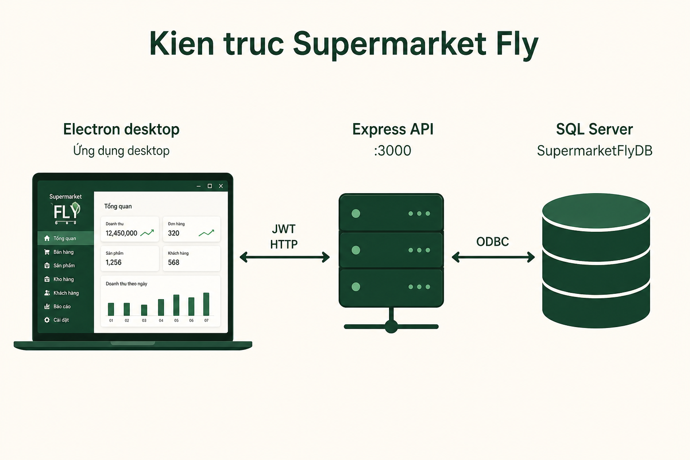

---

## 4. Cách hiểu hệ thống (tiền và hàng)

Ba “cột tiền” **không được trộn**:

1. **Hàng và giá vốn** — bán xong trừ tồn, dòng hóa đơn giữ `DonGiaVon`. Lãi gộp = tiền bán thuần − giá vốn thuần. Đổi trả làm giảm doanh thu/giá vốn, không sửa tay tồn.
2. **Két ca thu ngân** — chỉ tiền mặt khách đưa tại quầy (trừ hoàn tiền mặt). Cuối ca nộp phiếu thu. QR/thẻ **không** vào két. Phiếu thu **không** cộng thêm một lần doanh thu.
3. **Công nợ NCC và quỹ lương** — nợ NCC chỉ sinh khi kế toán **đối chiếu khớp** đơn + phiếu nhập + hóa đơn mua. Duyệt phiếu / giao quỹ **chưa** phải đã trả. Lương: quản lý giao **một quỹ cho kế toán**, kế toán mới chi từng người. Ngày tất toán lương (và hướng cước vận chuyển) là **mùng 10**.

Hàng đi: *đề nghị (sau khi thủ kho đếm thật) → đơn mua (QL duyệt) → giao → kiểm → nhập (chỉ SL chấp nhận) → kệ → bán / đổi trả / xuất hủy*.

Người dùng không nhìn “bảng SQL”. Họ nhìn **chứng từ và trạng thái**: Chờ duyệt → Đã duyệt → Thành công / Thất bại.

---

## 5. Ai dùng phần mềm

Năm **actor** (loại vai trò). Tám thu ngân vẫn là một actor.

| Vai trò | Trong cửa hàng làm gì |
| --- | --- |
| Quản lý (QL) | Phê duyệt việc lớn, giao quỹ, phân ca, xem cửa hàng lãi/lỗ, nhật ký khi có sự cố |
| Mua hàng (MH) | Nhà cung cấp, biến đề nghị kho thành đơn mua, theo dõi giao hàng |
| Thủ kho (TK) | Đếm hàng, đề nghị khi hết/thiếu, nhận hàng, nhập–xuất, kiểm kê |
| Thu ngân (TN) | Đúng ca mới vào quầy; bán, thu tiền, đóng ca |
| Kế toán (KT) | Đối chiếu mua, công nợ, phiếu thu ca, lập/khóa/chi lương, báo cáo nội bộ |

Khách và NCC **không có tài khoản**.

---

## 6. Ảnh demo giao diện thật

Hai ảnh dưới chụp từ `desktop/src/pages` khi chạy static (`localhost:4173`). Đăng nhập nội bộ, không phải web khách.

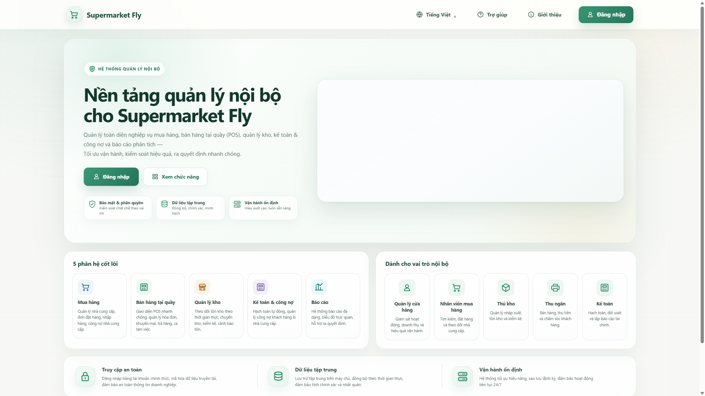

*Trang giới thiệu — 5 phân hệ và 5 vai trò. Một số câu trên landing mang tính giới thiệu (ví dụ “công nợ khách hàng”); **nghiệp vụ thật không bán chịu**, không có công nợ phải thu.*

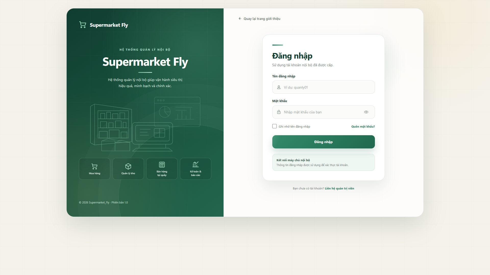

*Đăng nhập: trái minh họa mua / kho / quầy / kế toán; phải form tài khoản nội bộ (`admin`, `thukho`, `ketoan`…).*

Các màn sau login (kho, POS, lương, quỹ, lãi/lỗ) — minh họa đúng palette xanh FLY:

| Kho (Thủ kho) | Quầy (Thu ngân) |
| --- | --- |
| 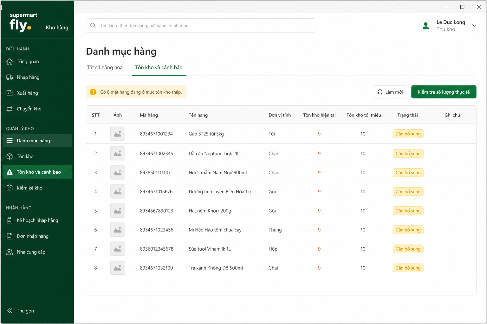 | 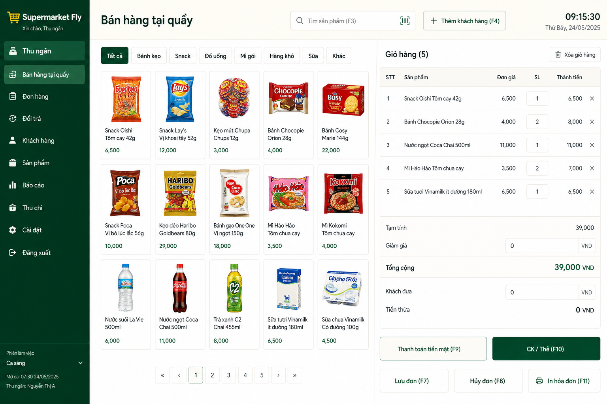 |

| Lương (Kế toán) | Giao quỹ (Quản lý) |
| --- | --- |
| 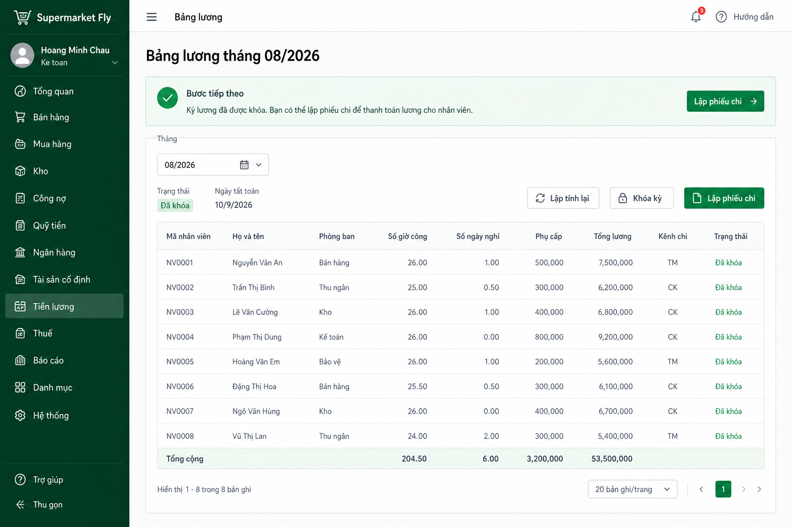 | 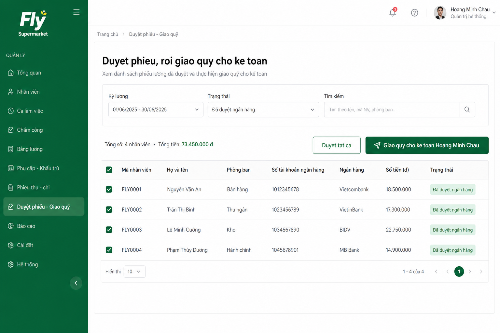 |

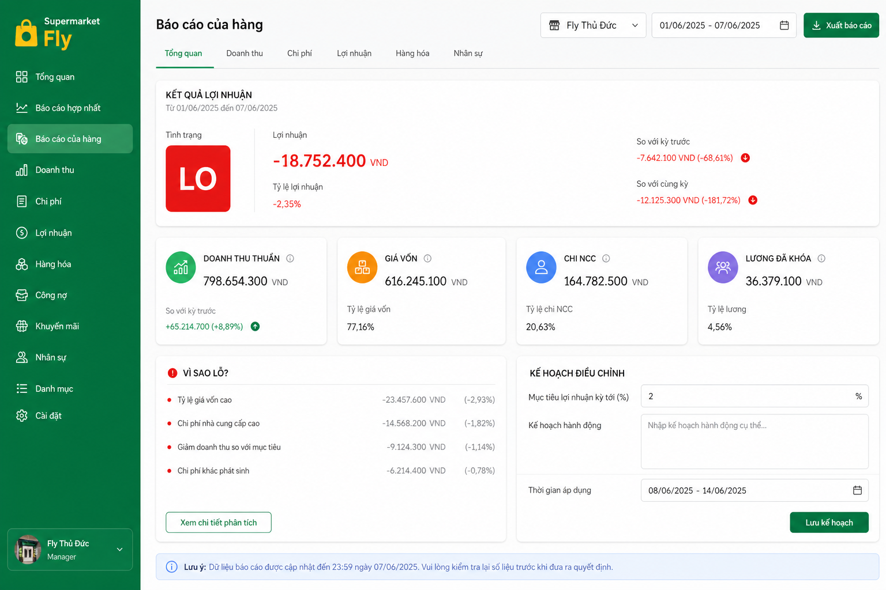

---

## 7. Ba quy trình chuẩn (đúng logic đã chốt)

Ba quy trình này là xương sống đồ án. Số trên chứng từ **chỉ đổi đúng bước**; mũi tên đứt = chưa được phép.

### Quy trình 1 — Mua hàng và nhập kho

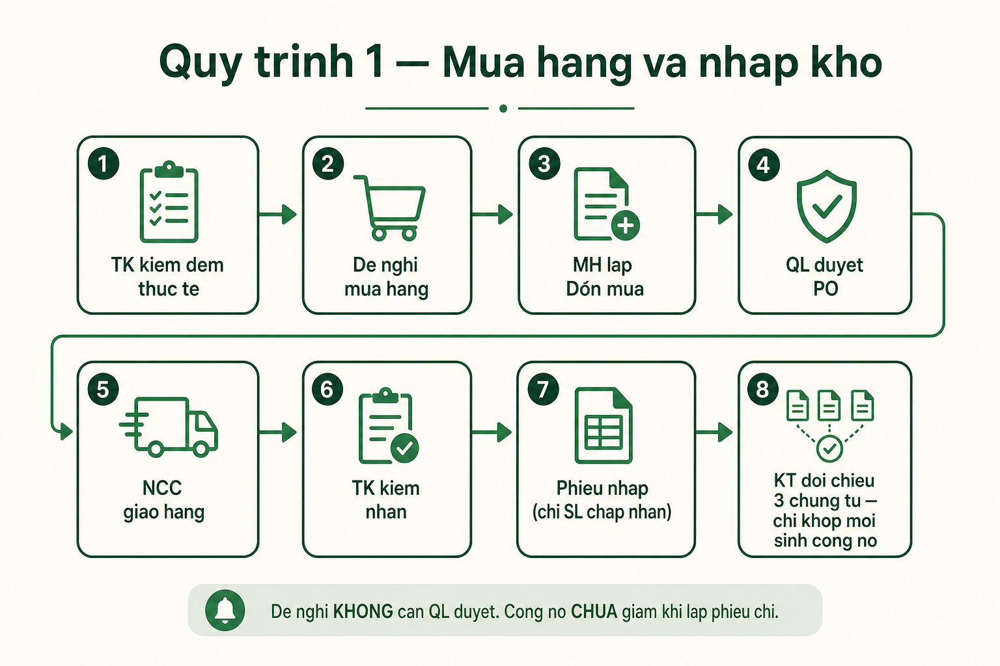

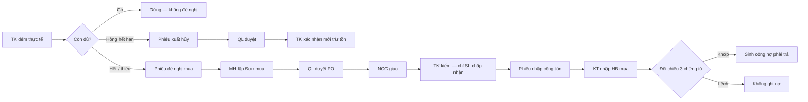

| Bước | Ai | Hệ thống được / không được |
| --- | --- | --- |
| 1. Cảnh báo tồn &lt; min | Máy | Chỉ **gợi ý**. Không tự thành đơn mua, không “đề nghị khai trương”. |
| 2. Kiểm đếm thực tế | TK | Đợt kiểm kê **đúng mặt hàng đã chọn**. Số đếm ≠ sổ thì ghi trên kiểm kê; tồn sổ chỉ đổi sau QL duyệt điều chỉnh. |
| 3a. Còn đủ | TK | **Không** lập đề nghị. |
| 3b. Hết / thiếu sau đếm | TK | Lập **Phiếu đề nghị** → gửi MH. **QL không duyệt đề nghị.** |
| 3c. Hỏng / hết hạn | TK | **Phiếu xuất hủy** → QL duyệt → TK xác nhận mới trừ tồn. |
| 4. Đơn mua | MH | Chọn NCC, số lượng, giá. |
| 5. Duyệt PO | QL | **Lần duyệt duy nhất** trên đơn. |
| 6. Nhận hàng | TK | Đạt / thiếu / sai / hư. Chỉ `SoLuongChapNhan` vào phiếu nhập. Hàng hư **không** cộng tồn. |
| 7. Đối chiếu 3 bên | KT | Đơn + phiếu nhập + HĐ GTGT (SP, SL, đơn giá, thuế mua, tổng). |
| 8. Công nợ | Máy | **Chỉ khi khớp.** Hạn = ngày đối chiếu + 30–45 ngày. Trả một lần đủ. |

**Cấm:** trả trước, trả từng phần, giảm nợ lúc lập phiếu chi hoặc lúc QL duyệt phiếu chi NCC. Nợ chỉ về 0 khi KT ghi thanh toán **thành công**.

---

### Quy trình 2 — Bán tại quầy và quỹ ca

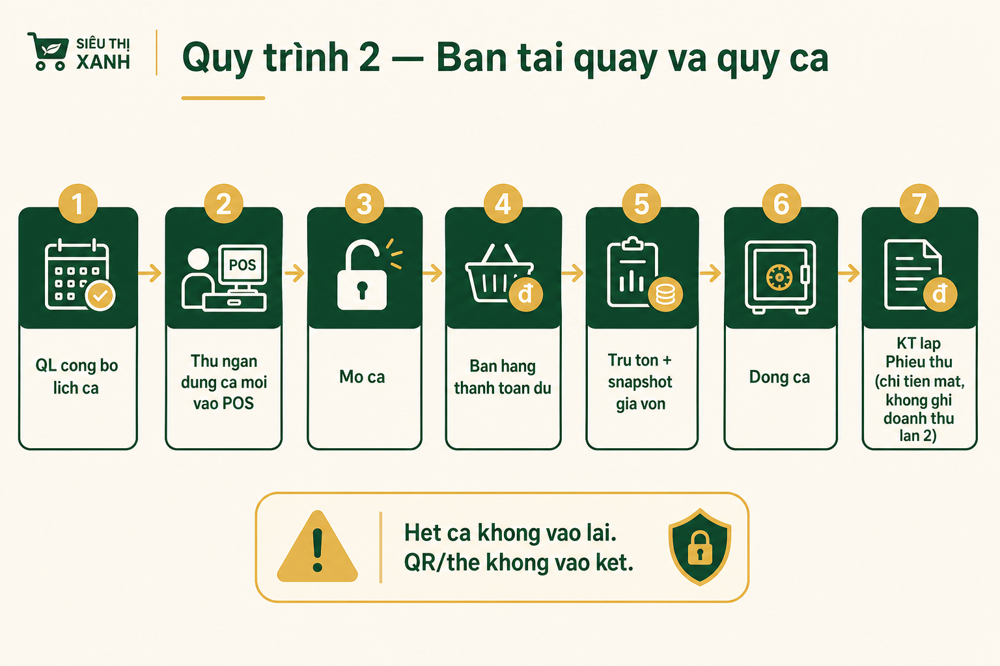

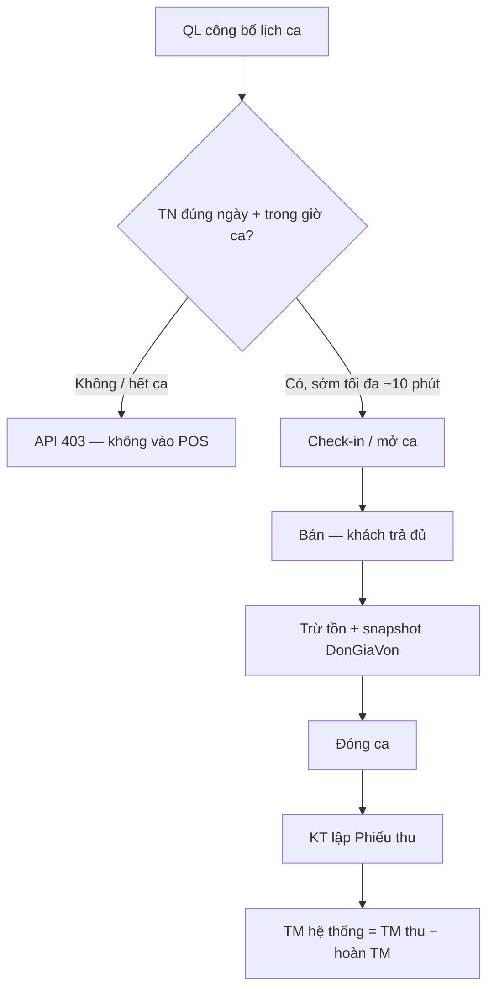

| Bước | Ai | Logic đã chốt |
| --- | --- | --- |
| Phân ca | QL | Lịch **Đã công bố**. Ca hành chính T2–T7; thu ngân theo ngày có lịch. |
| Vào quầy | TN | Phải đúng **hôm nay** và **trong khung giờ**. Hết giờ ca / đã đóng: **không vào lại, không bán**. |
| Bán | TN | Thanh toán **đủ** tại quầy. Không công nợ phải thu, không TK 131. |
| Tồn và lãi gộp | Máy | HĐ hoàn thành mới trừ tồn. DT thuần − GV thuần = lãi gộp. |
| Đổi trả | TN (+ QL nếu lệch giá) | Không cộng doanh thu lần hai. |
| Két ca | TN → KT | Chỉ **tiền mặt**. QR / thẻ / CK **không** vào két. Một ca **một** phiếu thu. |
| Phiếu thu | KT | Không phải biên bản chênh lệch riêng — lý do ghi trên phiếu. **Không** Co doanh thu lần hai. |

---

### Quy trình 3 — Lương tháng (tất toán mùng 10)

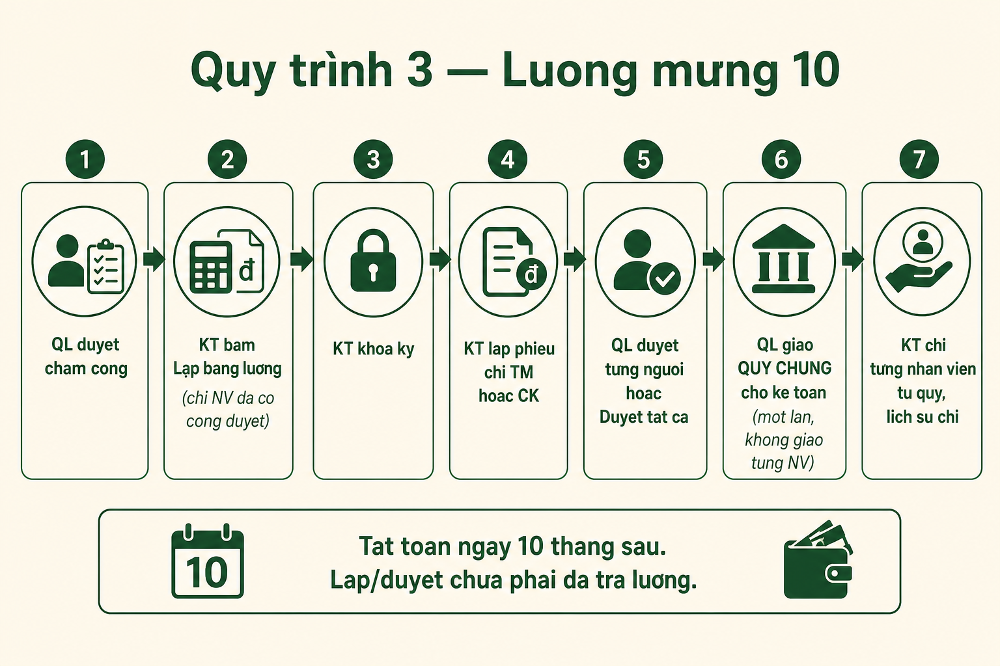

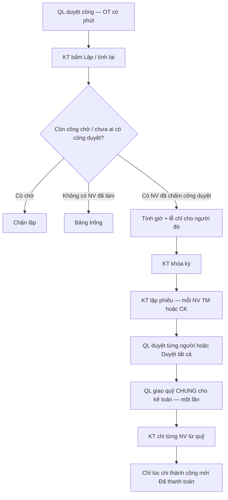

| Bước | Ai | Logic đã chốt |
| --- | --- | --- |
| Ngày lễ | QL | Khai năm (Tết âm, Giỗ Tổ, liền kề 02/09). |
| Chấm công | NV / QL duyệt | Chỉ **Đã duyệt** vào lương. |
| Lập bảng | **Chỉ KT** | GET **không** tự tạo số. QL lập → 403. |
| Ai có dòng | Máy | Chỉ NV **phút công duyệt &gt; 0**. Lễ 8h chỉ cộng cho người đã đi làm trong kỳ. Không lập kỳ tương lai. |
| Ngày trả | Máy | **Mùng 10 tháng sau** (kỳ 08 → 10/09). Sau 10 vẫn chi được, gắn trễ. |
| Kênh | KT | Mỗi NV/kỳ **một** kênh: TM **hoặc** CK. |
| Duyệt | QL | Từng phiếu hoặc **Duyệt tất cả**. Duyệt **chưa** trả lương. |
| Giao quỹ | QL | **Một cục cho kế toán** (không giao từng NV). Khác phiếu chi NCC (vẫn giao từng phiếu). |
| Chi | KT | Rút từ quỹ đã nhận. CK bắt buộc mã GD. Fail → cùng phiếu, làm lại. |
| Lãi gộp | Máy | **Không** trừ bảng lương. QL xem lãi/lỗ sau chi phí ở báo cáo cửa hàng (trừ lương đã khóa). |

---

## Mục lục (vận hành kỹ thuật)

1. [Cài đặt và chạy](#cài-đặt-và-chạy)
2. [Tài khoản test](#tài-khoản-test)
3. [Năm actor và phạm vi](#năm-actor-và-phạm-vi)
4. [Kiến trúc](#kiến-trúc)
5. [Cây thư mục](#cây-thư-mục)
6. [Luồng nghiệp vụ chính](#luồng-nghiệp-vụ-chính)
7. [Kế toán nghiệp vụ đã chốt](#kế-toán-nghiệp-vụ-đã-chốt)
8. [Lương, ngày lễ, quỹ chung](#lương-ngày-lễ-quỹ-chung)
9. [Báo cáo lãi / lỗ cửa hàng (QL)](#báo-cáo-lãi--lỗ-cửa-hàng-ql)
10. [Nhật ký và thông báo](#nhật-ký-và-thông-báo)
11. [API](#api)
12. [CSDL và migration](#csdl-và-migration)
13. [Lệnh npm / test](#lệnh-npm--test)
14. [Những gì cố ý chưa làm](#những-gì-cố-ý-chưa-làm)
15. [Xử lý sự cố thường gặp](#xử-lý-sự-cố-thường-gặp)
16. [Tài liệu liên quan](#tài-liệu-liên-quan)

---


## Cài đặt và chạy

### Yêu cầu máy

- Windows, **Node.js** và **npm** trên PATH
- **SQL Server** (thường SQL Express) + **ODBC Driver 17 for SQL Server**
- Kết nối trong `server/src/config/db.js`: Windows Authentication, instance `localhost\SQLEXPRESS`, database `SupermarketFlyDB`, `useUTC: false` (giờ Hà Nội). File `.env.example` có `DB_USER`/`DB_PASSWORD` nhưng **runtime hiện dùng trusted connection** trong `db.js`

### Lần đầu

1. Tạo database `SupermarketFlyDB` (script gốc `server/migrations/SupermarketFly_CreateDB.sql` nếu máy trống).
2. Trong thư mục này:

```text
1_CAI_DAT_LAN_DAU.bat
```

Hoặc: `npm install` ở root, `server/`, `desktop/`.

3. Migration + seed quyền/tài khoản + dọn dữ liệu demo:

```text
npm run setup:next
```

(`migrate:next` lần lượt chạy các file SQL từ 20260825 đến 20260905, rồi seed permissions/accounts, xóa SP demo thừa, thu ngân thừa, chuẩn bị kho.)

4. Copy `server/.env.example` → `server/.env` nếu cần (cổng 3000). **Không commit `.env`.**

### Chạy hàng ngày (một máy)

```text
2_CHAY_SUPERMARKET_FLY.bat
```

hoặc `npm start` (mở song song API và Electron).

### Test nhóm trên một database

Một người (máy chủ) giữ SQL Server + API. Các thành viên chỉ mở desktop, nhập IP máy chủ ở màn đăng nhập, mỗi người một vai trò — không cần đăng xuất để test bước tiếp theo.

```text
4_CHAY_MAY_CHU_NHOM.bat      (máy chủ, giữ cửa sổ mở, gửi IP vào nhóm)
5_CHAY_MAY_THANH_VIEN.bat    (máy thành viên — không cần SQL Server)
```

Chi tiết: [docs/HUONG_DAN_TEST_DB_CHUNG.md](docs/HUONG_DAN_TEST_DB_CHUNG.md).

- API: `http://localhost:3000` — kiểm tra `GET /api/health`, `GET /api/test-db`
- Desktop: cửa sổ Electron. **Đóng hẳn app rồi mở lại** khi vừa kéo JS mới (không chỉ F5)

Test tự động: `3_KIEM_TRA_TU_DONG.bat` hoặc `npm run test:next`.

---

## Tài khoản test

Mật khẩu mặc định **`123`** (seed `server/seed-accounts.js`).

| Đăng nhập | Vai trò | Nhân viên |
| --- | --- | --- |
| `admin` | Quản lý cửa hàng (QL) | Nguyễn Minh Anh |
| `muahang` | Nhân viên mua hàng (MH) | Trần Thu Hà |
| `thukho` | Thủ kho (TK) | Lê Đức Long |
| `ketoan` | Kế toán (KT) | Hoàng Minh Châu |
| `thungan` | Thu ngân (TN) | Phạm Thảo Vy |
| `thungan02` … `thungan08` | Thu ngân | 7 thu ngân còn lại |

Đúng **5 vai trò** trên Use Case. Tám thu ngân không tạo actor thứ sáu.

---

## Năm actor và phạm vi

| Actor | Việc chính | Thư mục UI |
| --- | --- | --- |
| **QL** | Phê duyệt PO / kiểm kê / xuất kho / đổi trả / phiếu chi NCC; giao **quỹ lương cho kế toán**; phân ca, duyệt công, ngày lễ năm; SP–giá–KM–NV–TK; nhật ký hệ thống; báo cáo cửa hàng và **lãi/lỗ** | `desktop/src/pages/admin/`, `dashboard/`, `workforce/` |
| **MH** | NCC, đọc đề nghị từ kho, lập đơn mua, theo dõi giao hàng | `warehouse/supplier-pages.js`, `purchase-order-pages.js` |
| **TK** | Tồn kho, kiểm đếm thực tế rồi mới đề nghị mua (hết giai đoạn khai trương), nhận hàng, phiếu nhập, xuất hủy, kiểm kê, kiểm đổi trả | `warehouse/` |
| **TN** | Lịch ca, check-in, POS, hóa đơn, đổi trả, đóng ca | `cashier/` |
| **KT** | Đối chiếu 3 chứng từ mua, công nợ NCC, phiếu thu ca, bảng lương, chi lương từ quỹ QL đã giao, **kế toán mini (sổ cái, VAT, TSCĐ, sao kê)**, báo cáo nội bộ | `accounting/`, `accounting/ledger-pages.js` |

**Không có** actor Nhân sự riêng, không BHXH/BHYT trên phiếu lương, không nhiều chi nhánh, không bán chịu (không TK 131).

---

## Kiến trúc

```text
[ Electron desktop ]  --HTTP JWT-->  [ Express :3000 ]  -->  [ SQL Server ]
     pages theo vai trò                 routes / controllers
                                        services (lương, P&L, ca…)
                                        /uploads ảnh sản phẩm
```

- Sau login, `dashboard.html` + `dashboard.js` load trang động (`window.FLY_ROLE_PAGES`) theo `TenVaiTro`.
- Quyền theo **mã UC** (`requirePermission('UC27')` …), không chỉ tên vai trò.
- Ảnh sản phẩm: bắt buộc khi tạo SP; file tĩnh `/uploads`.

---

## Cây thư mục

```text
supermarket-fly/
├── 1_CAI_DAT_LAN_DAU.bat
├── 2_CHAY_SUPERMARKET_FLY.bat
├── 3_KIEM_TRA_TU_DONG.bat
├── package.json              npm start, setup:next, test:next
├── docs/                     hướng dẫn test, bàn giao, kế toán đã chốt
├── desktop/src/
│   ├── index.js, preload.js
│   └── pages/
│       ├── landing, login
│       ├── dashboard         vỏ app + sidebar
│       ├── admin             QL: SP, NV, TK, KM, phân quyền, nhật ký
│       ├── warehouse         TK + MH
│       ├── cashier           POS, ca
│       ├── accounting        KT + P&L nhúng cho QL
│       ├── workforce         phân ca, ngày lễ
│       └── shared            in, chart, ảnh, locale VI
└── server/
    ├── apply-migration.js
    ├── seed-accounts.js, seed-permissions.js
    ├── migrations/           CreateDB + chuỗi đến 20260910 (gồm sổ cái + MoMo)
    ├── uploads/
    └── src/
        ├── app.js            mount /api/*
        ├── config/db.js
        ├── routes/           accounting, ledger, cashier, telegram, paymentGateway…
        ├── controllers/
        ├── services/         journalEngine, paymentGateway (MoMo), telegram*,
        │                     payrollEngine, storeProfitLoss, cashierDuty…
        └── middlewares/      auth, upload ảnh
```

Workspace Cursor còn `../TaiLieu_Du_An/` (không commit vào repo này).

---

## Luồng nghiệp vụ chính

### Mua hàng và nhập kho (đã qua khai trương)

1. Hệ thống **cảnh báo** tồn dưới mức tối thiểu — chỉ là gợi ý.
2. Thủ kho **kiểm đếm thực tế** (đợt kiểm kê đúng mặt hàng đã chọn). Còn đủ → thôi. Thiếu → **Phiếu đề nghị mua hàng** gửi MH (không duyệt QL ở bước này). Hỏng / hết hạn → **Phiếu xuất hủy** (QL duyệt, TK xác nhận mới trừ tồn).
3. MH chọn NCC, lập **Đơn mua**.
4. QL **phê duyệt PO** (lần duyệt duy nhất trên đơn).
5. NCC giao → TK kiểm (đạt / thiếu / sai / hư) → **Phiếu nhập**. Chỉ `SoLuongChapNhan` cộng tồn khi xác nhận.
6. KT nhập HĐ GTGT mua, **đối chiếu 3 chứng từ** (đơn + phiếu nhập + HĐ). Khớp mới sinh `CongNoPhaiTra`. Lệch không ghi nợ.

Nút **Lập đề nghị khai trương** đã bỏ.

### Bán tại quầy

- Bán **đủ**, không bán chịu.
- Thu ngân chỉ mở POS khi có **lịch Đã công bố đúng hôm nay** và **trong khung giờ ca** (vào sớm tối đa khoảng 10 phút). **Hết ca không vào lại, không bán** — API trả 403, không chỉ khóa nút.
- Hóa đơn hoàn thành trừ tồn, snapshot giá vốn dòng.
- Đổi trả: quy tắc ngang giá / duyệt QL tùy UC đã cài.
- Đóng ca → KT lập **Phiếu thu** (tiền mặt hệ thống = TM thu − hoàn TM). QR/thẻ/CK không vào két. Một ca một phiếu thu. Chênh lệch ghi lý do trên phiếu. Phiếu thu **không** ghi doanh thu lần hai.

### Công nợ NCC và phiếu chi

- Nợ 30–45 ngày; trả **một lần đủ**, không trả trước / trả góp.
- KT lập phiếu chi (có thể sớm); số tiền khóa = còn lại.
- **Lập phiếu / QL duyệt-giao quỹ NCC chưa giảm nợ.** Chỉ khi KT ghi thanh toán **thành công** thì `SoTienConLai = 0`.
- QL duyệt phiếu chi NCC = giao quỹ theo **từng phiếu** (TM hoặc ủy quyền CK). Khác quỹ lương (xem dưới).

### Kho sau nhận hàng

- Kiểm kê định kỳ: lệch → chờ QL duyệt điều chỉnh; không UPDATE `TonKho` tay.
- Xuất thủ công / hủy: QL duyệt → TK xác nhận mới trừ tồn.

---

## Kế toán nghiệp vụ đã chốt

Chi tiết P0: [docs/PHUONG_AN_KE_TOAN_DA_CHOT.txt](docs/PHUONG_AN_KE_TOAN_DA_CHOT.txt) (luật tiền–hàng–nợ **vẫn đúng**; đoạn “chưa sổ cái” ở cuối file đó là mốc 02/09 — **đã làm sau đó**).

- Lãi gộp nội bộ = DT thuần − GV thuần. **Bảng lương không trừ vào lãi gộp.**
- Kỳ báo cáo theo `Asia/Ho_Chi_Minh`. Ngày 1–3: ô tháng mặc định lùi tháng trước. Nút **Lập báo cáo** trên màn điều hành = tổng hợp chứng từ P0, **không** chi tiền.
- **Kế toán mini đã code (09/09/2026):** migration `20260909_AccountingCore`, `journalEngine.js`, `ledgerController.js`, menu `ledger-*`. Hạch toán lúc chứng từ hợp lệ: bán Nợ 111/112 Có 511+33311; giá vốn Nợ 632 Có 156; khóa lương Nợ 642 Có 334; chi lương Nợ 334 Có 111/112; khớp 3 bên Nợ 156+1331 Có 331; trả NCC Nợ 331 Có 111/112.
- Cẩm nang + 74 case test tay: [docs/CAM_NANG_KE_TOAN_MINI.txt](docs/CAM_NANG_KE_TOAN_MINI.txt), [docs/BAN_TEST_CHUC_NANG_KE_TOAN_MINI_A_Z.txt](docs/BAN_TEST_CHUC_NANG_KE_TOAN_MINI_A_Z.txt).

---

## Lương, ngày lễ, quỹ chung

### Ai làm gì

| Bước | Ai | Việc |
| --- | --- | --- |
| Phân ca, ngày lễ, duyệt công | QL | UC30, UC32. OT ngoài ca phải xác nhận phút |
| Lập / tính lại / khóa kỳ | **Chỉ KT** | API 403 nếu QL bấm lập. GET **không** tự tạo bảng lương |
| Lập phiếu chi lương | KT | Mỗi NV/kỳ một phiếu, **TM hoặc CK** (không vừa TM vừa CK) |
| Duyệt phiếu | QL | Từng người hoặc **Duyệt tất cả** |
| Giao quỹ | QL | **Một lần cho kế toán** (không giao từng NV). Nút: *Giao quỹ cho kế toán* |
| Chi lương | KT | Rút từng NV từ quỹ đã nhận. CK bắt buộc mã GD |

### Ngày trả

Tất toán **mùng 10 tháng sau** kỳ lương (kỳ 08 → 10/09). Chi sau ngày 10 vẫn được, gắn trễ + lý do.

### Ai có mặt trên bảng lương

- Chỉ khi KT bấm **Lập / tính lại**.
- Chỉ NV có **chấm công Đã duyệt**, phút công > 0 trong kỳ. Không cộng ngày lễ cho cả cửa hàng khi chưa ai làm.
- Không lập kỳ tương lai. Còn công chờ duyệt thì không lập được.

### Hệ số (BLLĐ 2019 + NĐ 145/2020)

Ngày thường 100%, đêm 130%, OT ngày 150%, nghỉ tuần 200%, lễ trong ca 300% (+ đêm/OT lễ theo nghị định). Nghỉ lễ hưởng lương: 8 giờ chuẩn × đơn giá — **chỉ người đã có công duyệt trong kỳ**. BHXH không tính (`Thuong`/`KhauTru` = 0).

QL khai **Ngày lễ năm** (Tết âm, Giỗ Tổ, ngày liền kề 02/09). Seed 2026: Tết 16–20/02 (TB 9441/BNV), Giỗ Tổ 26/04, liền kề Quốc khánh mặc định 01/09.

### Tách quỹ

Phiếu chi **NCC** vẫn duyệt + giao **từng phiếu**. Phiếu chi **lương** dùng bảng riêng (`PhieuChiLuong`), không tái sử dụng `PhieuChi` (ràng buộc `MaCongNo`).

---

## Báo cáo lãi / lỗ cửa hàng (QL)

Tab đầu **Báo cáo cửa hàng**: *Cửa hàng đang lãi hay lỗ*. Không thay báo cáo lãi gộp cũ. Không thay KQKD sổ cái (UC43).

**KQKD điều hành (đúng, dùng để bảo vệ)**

Doanh thu thuần − giá vốn thuần − lương **đã khóa** − cước (khi có chứng từ 642). **Không trừ** Phiếu chi NCC thành công. Code: `storeProfitLossMath.kqkdLoiNhuan`.

**Dòng tiền / thu-chi (tab cùng màn, không gọi là lãi kế toán)**

Tiền thu khách − tiền trả NCC − trả lương − chi phí đã chi. Chi NCC chỉ hiện ở đây. Field API cũ `laiLoSauChiPhi` vẫn trừ NCC — **deprecated**, không dùng làm “cửa hàng lỗ”.

**Tiền có trả lương không?** Phiếu thu ca (TM) + đã thu CK/QR/thẻ so với lương đã khóa.

Chi phí điện/nước/thuê mặt bằng: đã có chứng từ UC36 trên Kế toán tổng hợp; màn P&L điều hành P0 **không** cộng đủ mọi 642 (xem KQKD sổ cái). Cước 4.000 đ/km + bồi 20% **chưa code**.

Khi **lỗ KQKD** (hoặc DT thuần < lương khóa): hiện nguyên nhân theo số thật (không lấy `chi_ncc_lon` làm lỗ kế toán); QL bắt buộc nhập kế hoạch điều chỉnh (≥ 50 ký tự) → **Lưu và gửi thông báo toàn cửa hàng**. Kỳ lãi không bắt plan. Lịch sử plan không xóa.

---

## Nhật ký và thông báo

- **QL — Nhật ký hệ thống:** việc làm tiếng Việt, lọc 1 hàng + lịch Từ–Đến, panel chi tiết, xuất CSV, không xóa/sửa log. Mặc định 7 ngày, có thể ẩn đăng nhập.
- **KT — Lịch sử hoạt động:** việc của kế toán đang login + lịch sử chi lương từ quỹ chung.
- **TK — Lịch sử kho:** việc đã làm tại kho (kiểm kê, nhập, xuất, đề nghị).
- Chuông thông báo 12s: phê duyệt, kế hoạch lỗ, công chờ duyệt, v.v.

### Telegram companion cho Quản lý

- Dashboard dạng card: trạng thái vận hành, doanh thu, giá vốn, lãi gộp, tỷ trọng 4 kênh thanh toán và các cảnh báo cần ưu tiên.
- Menu ba ngôn ngữ, nút dùng màu mặc định tương thích mọi giao diện Telegram, điều hướng **Tổng quan / Làm mới / Báo cáo / Chứng từ** và cập nhật ngay trên tin hiện tại để không làm đầy chat.
- Báo cáo quản trị **Tháng / Quý / Năm**: doanh thu hóa đơn, hoàn tiền, doanh thu thuần, giá vốn, lãi gộp, chi NCC/cước, lương đã khóa, lãi/lỗ sau chi phí, biên lợi nhuận, dòng tiền và so sánh cùng tiến độ kỳ trước.
- Công nợ, tồn thấp, ca, thanh toán, lương và việc chờ có badge màu, progress bar và phân cấp nội dung rõ trên màn hình điện thoại.
- Khi tải dữ liệu/chứng từ, Telegram hiện animation `typing` / `upload_photo`. **Code đã có nút duyệt inline** (PO, phiếu xuất, kiểm kê, đổi trả, phiếu chi NCC, chấm công) qua `telegramApprove.js` + audit; lệnh chữ `/approve` bị chặn. PLAN_12 gốc (05/09) ghi “không duyệt” — **lệch với code hiện tại**.
- Có thể bật message effect cho chat riêng bằng `TELEGRAM_EFFECT_SUCCESS_ID` và `TELEGRAM_EFFECT_ALERT_ID`; để trống thì bot vẫn chạy bình thường.
- Bảo mật giữ nguyên: OTP từ Fly, kiểm tra vai trò/quyền UC ở mỗi lệnh, webhook secret, chống gửi lặp và ghi Nhật ký hệ thống.

---

## API

Prefix `/api`. Health: `GET /api/health`.

| Prefix | Việc |
| --- | --- |
| `/api/auth` | Đăng nhập |
| `/api/accounts`, `/roles`, `/employees` | TK, vai trò, NV |
| `/api/admin` | QL: catalog, phê duyệt, báo cáo, phân ca, ngày lễ, P&L |
| `/api/warehouse` | Tồn, kiểm kê, nhập, xuất, đề nghị |
| `/api/purchasing`, `/api/suppliers` | Đơn mua, NCC, đề nghị inbox |
| `/api/accounting` | Đối chiếu, công nợ, phiếu thu, lương, quỹ, lịch sử KT |
| `/api/ledger` | Kế toán mini UC34–UC43: COA, kỳ, bút toán, NKC/sổ cái/CĐPS, KQKD/LCTT/BCĐKT, TSCĐ, sao kê |
| `/api/accounting/reconciliation` | P3 đối soát NH thông minh (UC42): import CSV, chạy engine, KT xác nhận |
| `/api/admin/loyalty` | P4 RFM thành viên (QL UC10). TN: `GET /api/cashier/customers/:id/loyalty` |
| `/api/cashier` | Ca, POS, HĐ, đổi trả, thanh toán ZaloPay QR |
| `/api/payments/gateway` | IPN/return ZaloPay (không JWT) |
| `/api/notifications` | Chuông |
| `/api/telegram` | Liên kết OTP, trạng thái kênh và webhook Telegram |

Một số endpoint lương / quỹ:

- `POST /api/accounting/payroll/:month/build` — chỉ KT
- `POST /api/admin/approvals/payroll-vouchers/approve-all`
- `POST /api/admin/approvals/payroll-fund/:month/handover` — giao quỹ cho KT
- `GET /api/admin/reports/store-profit-loss`
- `POST /api/admin/reports/store-profit-loss/plan`

---

## CSDL và migration

Thư mục `server/migrations/`:

| File | Việc |
| --- | --- |
| `SupermarketFly_CreateDB.sql` | Tạo DB / bảng lõi |
| `20260824_OpeningCatalog` / `DeliveryTracking` / `CleanupLegacyCategories` | Catalog, giao hàng, dọn nhóm cũ |
| `20260825_WorkforceScheduling` / `SalesAndWorkforceV2` / `OfficeHours` | Ca, bán, giờ hành chính |
| `20260830_ProductImages` | Ảnh SP |
| `20260901_PaymentFundHandover` | Giao quỹ phiếu chi NCC |
| `20260902_AuditLog` | Cột nhật ký mở rộng |
| `20260903_PayrollEngine` | Lễ, hệ số, phiếu chi lương |
| `20260904_PayrollCommonFund` | Quỹ lương chung QL → KT |
| `20260905_StoreProfitLoss` | Kế hoạch điều chỉnh khi lỗ |
| `20260907_*` | Đổi trả bàn giao, hồ sơ NV, phiếu thu số âm |
| `20260908_TelegramCompanion` (+ kiểm kê/xuất) | Telegram OTP / ChatId |
| `20260909_AccountingCore` (+ LedgerUiLabels) | Sổ cái mini UC34–UC43 |
| `20260910_PaymentGateway` (+ Qr) | Cổng MoMo: `NguonXacNhan`, `MaThamChieuCong` |
| `20260910_SmartBankReconciliation` | P3: `KetQuaDoiSoatNganHang`, `UngVienDoiSoat`, `MaThamChieu` |

Chạy lẻ: `cd server && node apply-migration.js <tên-file.sql>`  
Hoặc cả chuỗi: `npm run setup:next` / `npm run migrate:next`.

Một số controller còn `ensure*Schema()` lúc gọi API (máy cũ tự ALTER), nhưng máy setup mới nên chạy migration.

---

## Lệnh npm / test

Ở **root repo**:

| Lệnh | Việc |
| --- | --- |
| `npm start` | API + Electron |
| `npm run setup:next` | migrate + seed + dọn demo |
| `npm run test:next` | syntax check + test nghiệp vụ / ảnh / tìm kiếm / in / ca |

Ở **server** thêm: `test:payroll`, `test:payroll-fund`, `test:store-pnl`, `test:business`, `test:telegram`, …

---

## Những gì cố ý chưa làm

| Hạng mục | Ghi chú |
| --- | --- |
| Trợ lý AI (`POST /api/assistant/ask`) | PLAN_12 #2 — **P2-MIN đã có**. P2-ĐỦ chưa hết. **P3/P4 không thuộc P2-ĐỦ** — AI chỉ đọc summary qua tool |
| Đối soát NH thông minh (P3) | **Đã demo** · UC42 · `docs/PLAN_P3_DOI_SOAT_NGAN_HANG_THONG_MINH.txt` · engine không LLM, KT xác nhận, không tự ghi sổ |
| Loyalty RFM (P4) | **MVP** · UC10/UC23 · `docs/PLAN_P4_CUSTOMER_LOYALTY_INTELLIGENCE.txt` · không email/SMS/app KH |
| OCR hóa đơn NCC | PLAN_12 #4 — chưa code |
| E-receipt token / QR xem HĐ trên điện thoại | PLAN_12 #8 — chưa; in PDF nội bộ đã có |
| Webcam / ZXing trên POS | PLAN_12 #5 — mới gõ tay + USB HID vào ô tìm |
| Smart replenishment (TB bán 7 ngày) | PLAN_12 #6 — mới cảnh báo tồn min + `SLDatMua` |
| VNPay / PayOS / MoMo chạy thật | Stub; cổng đang dùng = **ZaloPay sandbox** |
| Sentry, n8n, Firebase, Ollama riêng, thời tiết | Cắt hoặc không slide (PLAN_12 #7, #9–#12) |
| BHXH / BHYT / BHTN / công đoàn | Ngoài phạm vi BTL |
| Cước vận chuyển 4.000 đ/km, bồi thường 20% (NCC + nhà xe cùng chịu) khi hư ≥ 1/3 | **Đã chốt plan, chưa code** |
| TK 242, kho FEFO/lô, nhiều cửa hàng, HĐĐT nhà nước, bán chịu | Cắt |

Sổ cái / VAT POS / TSCĐ / sao kê / LCTT / BCĐKT **đã có** (UC34–UC43) — không còn nằm mục “chưa làm”.

Cước giao hàng (plan): siêu thị trả cước cho đơn vị NCC thuê; chuyến 10–100 km; thanh toán cước mùng 10; bồi **một gói 20%** giá trị chuyến chia mặc định 10% + 10%. Công nợ **hàng** vẫn chỉ khi đối chiếu 3 chứng từ khớp.

---

## Xử lý sự cố thường gặp

| Hiện tượng | Hướng xử lý |
| --- | --- |
| *Không thể mở trang / Failed to fetch* trên kho | API chết **hoặc** JS trang không load. Chạy `npm start`, xem `GET /api/health`. Đóng/mở lại Electron |
| Báo cáo đầu tháng trống / kẹt “Đang tải” | Đã sửa kỳ VN + lùi tháng ngày 1–3. Bấm **Lập báo cáo** khi nút đã bật. Tháng không có HĐ hoàn thành thì số = 0 |
| Bảng lương tháng 9 có 880k dù chưa làm | Rule cũ cộng lễ cho mọi NV. **Lập / tính lại** sau khi QL duyệt hết công. Chỉ người đã chấm công mới còn dòng |
| Không lập được kỳ lương | Còn `ChamCong` chờ duyệt, hoặc không phải KT |
| Không thấy “giao quỹ cho kế toán” | Nút là giao **một cục quỹ cho KT** sau khi duyệt phiếu. Không giao từng NV. Phiếu NCC vẫn giao từng phiếu |
| Thu ngân không vào được POS | Không có ca công bố hôm nay, **hoặc** ngoài giờ / đã hết ca |
| SQL không kết nối | Instance không phải `SQLEXPRESS`, thiếu ODBC 17, chưa tạo `SupermarketFlyDB`, Windows auth |

---

## Tài liệu liên quan

| File | Nội dung |
| --- | --- |
| [docs/README.md](docs/README.md) | Mục lục toàn bộ file trong `docs/` |
| [docs/PHUONG_AN_KE_TOAN_DA_CHOT.txt](docs/PHUONG_AN_KE_TOAN_DA_CHOT.txt) | Luật P0 đang chạy (tiền–hàng–nợ); đoạn “chưa sổ cái” là mốc 02/09 |
| [docs/PHAM_VI_KE_TOAN_DA_CHOT_LAI_31-08.txt](docs/PHAM_VI_KE_TOAN_DA_CHOT_LAI_31-08.txt) | Plan A: giữ / cắt (đã triển khai 09/09) |
| [docs/PLAN_ZALOPAY_TEST_P1.txt](docs/PLAN_ZALOPAY_TEST_P1.txt) | Cổng QR **đang dùng**: ZaloPay sandbox |
| [docs/PLAN_MOMO_TEST_P1.txt](docs/PLAN_MOMO_TEST_P1.txt) | Lịch sử cổng MoMo (10/09) |
| [docs/PLAN_AI_CHATBOT_TRO_LY.txt](docs/PLAN_AI_CHATBOT_TRO_LY.txt) | Plan + P2-MIN đã chạy (chưa P2-ĐỦ) |
| [docs/PLAN_P3_DOI_SOAT_NGAN_HANG_THONG_MINH.txt](docs/PLAN_P3_DOI_SOAT_NGAN_HANG_THONG_MINH.txt) | P3 đối soát NH thông minh |
| [docs/PLAN_P4_CUSTOMER_LOYALTY_INTELLIGENCE.txt](docs/PLAN_P4_CUSTOMER_LOYALTY_INTELLIGENCE.txt) | P4 RFM khách thành viên |
| [docs/HUONG_DAN_TEST_DON_GIAN_CHO_6_NGUOI.md](docs/HUONG_DAN_TEST_DON_GIAN_CHO_6_NGUOI.md) | Smoke test 6 người |
| [docs/HUONG_DAN_BAN_GIAO_CHO_THANH_VIEN_TEST.md](docs/HUONG_DAN_BAN_GIAO_CHO_THANH_VIEN_TEST.md) | Bàn giao Git / `.bak` |
| `../TaiLieu_Du_An/` | UC, CSDL mô tả, ảnh, backup môn học |

`docs/HUONG_DI_VA_THIET_KE_ACTOR_TIEP_THEO.md` mô tả hướng cũ (làm tiếp thủ kho/mua hàng) — **lỗi thời** nếu UC11–UC33 đã chạy; không dùng làm bước tiếp theo.

---

## Giấy phép

Mã nguồn đồ án học tập (desktop `package.json`: MIT; server ISC). Không phải sản phẩm thương mại.
