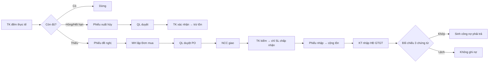
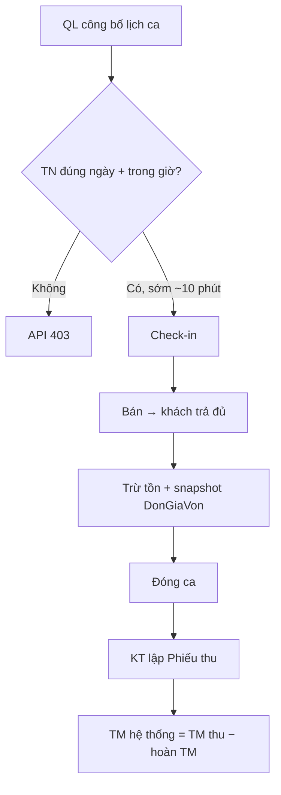
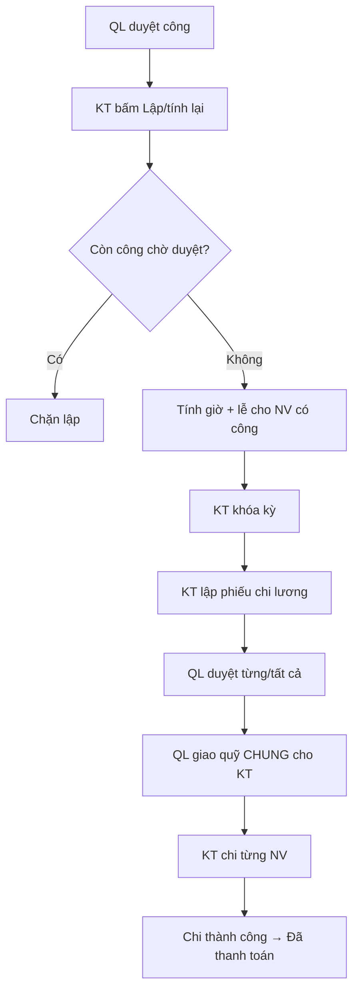

<div align="center">

# 🛒 Supermarket Fly

**Hệ thống quản lý nội bộ siêu thị — Accounting Information System (AIS)**


*Bài tập lớn môn Ứng dụng Hệ thống Thông tin Kế toán — Phần mềm chạy thật cho một cửa hàng siêu thị mini.*

</div>

---

## Mục lục

- [1. Tổng quan](#1-tổng-quan)
- [2. Kiến trúc hệ thống](#2-kiến-trúc-hệ-thống)
- [3. Công nghệ sử dụng](#3-công-nghệ-sử-dụng)
- [4. Cơ sở dữ liệu](#4-cơ-sở-dữ-liệu)
- [5. Năm vai trò & phân quyền](#5-năm-vai-trò--phân-quyền)
- [6. Các phân hệ nghiệp vụ](#6-các-phân-hệ-nghiệp-vụ)
  - [6.1 Mua hàng & Nhập kho](#61-mua-hàng--nhập-kho)
  - [6.2 Quản lý kho](#62-quản-lý-kho)
  - [6.3 Bán hàng tại quầy (POS)](#63-bán-hàng-tại-quầy-pos)
  - [6.4 Kế toán nghiệp vụ](#64-kế-toán-nghiệp-vụ)
  - [6.5 Kế toán tổng hợp (Sổ cái mini)](#65-kế-toán-tổng-hợp-sổ-cái-mini)
  - [6.6 Nhân sự & Tiền lương](#66-nhân-sự--tiền-lương)
  - [6.7 Báo cáo lãi / lỗ cửa hàng](#67-báo-cáo-lãi--lỗ-cửa-hàng)
- [7. Tính năng nâng cao](#7-tính-năng-nâng-cao)
- [8. API Reference](#8-api-reference)
- [9. Cấu trúc thư mục](#9-cấu-trúc-thư-mục)
- [10. Cài đặt & Chạy](#10-cài-đặt--chạy)
- [11. Tài khoản test](#11-tài-khoản-test)
- [12. Database Migrations](#12-database-migrations)
- [13. Lệnh npm & Test](#13-lệnh-npm--test)
- [14. Xử lý sự cố](#14-xử-lý-sự-cố)
- [15. Những gì cố ý chưa làm](#15-những-gì-cố-ý-chưa-làm)
- [16. Tài liệu liên quan](#16-tài-liệu-liên-quan)

---

## 1. Tổng quan

**Supermarket Fly** là phần mềm quản lý nội bộ hoàn chỉnh cho **một cửa hàng siêu thị mini** — từ mua hàng, nhập kho, bán hàng POS, đến kế toán kép, tính lương theo BLLĐ 2019, và báo cáo tài chính.

### Bối cảnh nghiệp vụ

| Đặc điểm | Chi tiết |
| --- | --- |
| **Quy mô** | Một cửa hàng, một kho logic, không chuỗi |
| **Nhân sự** | 12 nhân viên, 5 vai trò (Quản lý, Mua hàng, Thủ kho, 8 Thu ngân, Kế toán) |
| **Khách hàng** | Trả đủ tại quầy — không bán chịu, không công nợ phải thu |
| **Nhà cung cấp** | Giao hàng trước, cửa hàng nợ 30–45 ngày rồi trả **một lần đủ** |
| **Thanh toán** | Tiền mặt + QR ZaloPay (sandbox) — VNPay/MoMo là stub |

### Hệ thống giải quyết vấn đề gì?

Nếu không có phần mềm: đề nghị mua viết tay, nhập kho lệch hóa đơn, két ca không đối được với máy, công nợ "duyệt là đã trả", cuối tháng không biết tiền bán có đủ trả lương.

Supermarket Fly thay việc đó bằng **chứng từ điện tử + phân quyền UC + nhật ký kiểm toán**: mỗi nghiệp vụ có người chịu trách nhiệm, trạng thái rõ ràng, và số liệu chỉ thay đổi khi bước hợp lệ hoàn thành.

### Không phải

| Không phải | Lý do |
| --- | --- |
| Website bán hàng online | Khách không có tài khoản đăng nhập |
| ERP nhiều công ty / chuỗi | Một cửa hàng duy nhất |
| MISA / FAST đầy đủ | Sổ cái **mini** (18 TK, 1 TKNH); không tờ khai thuế nhà nước |
| Phần mềm BHXH | Không tính BHXH/BHYT; lương đơn thuần theo giờ công |

---

## 2. Kiến trúc hệ thống

```
 Máy nhân viên                  Máy cửa hàng (hoặc cùng máy)        SQL Server
┌─────────────────┐            ┌──────────────────────────┐        ┌────────────────┐
│  Electron 43    │   HTTP     │  Node.js / Express 5     │  ODBC  │ SupermarketFly │
│  (Desktop App)  │   JWT ──►  │  REST API :3000           │  17 ─► │ DB             │
│  HTML/CSS/JS    │            │  + Telegram Bot           │  WinA  │ (giờ Hà Nội)   │
└─────────────────┘            │  + ZaloPay Gateway        │        └────────────────┘
                               │  + SSE Notifications      │
                               │  + Chat Hub (polling)     │
                               └──────────────────────────┘
                                        ▲
                               Cloudflare Tunnel (tùy chọn)
                                        │
                               ┌────────┴────────┐
                               │  Telegram Bot    │
                               │  ZaloPay IPN     │
                               └─────────────────┘
```

**Luồng hoạt động:**
1. Nhân viên mở ứng dụng Electron → hiện trang Landing → Đăng nhập.
2. Sau login, `dashboard.js` tải sidebar động theo `TenVaiTro` (quyền khác nhau thấy menu khác nhau).
3. Mọi thao tác gọi REST API `/api/*` qua JWT — quyền kiểm tra realtime từ DB (không chỉ dựa token).
4. API xử lý nghiệp vụ → ghi SQL Server → trả kết quả → tự động hạch toán kế toán kép nếu cần.

---

## 3. Công nghệ sử dụng

| Tầng | Công nghệ | Vai trò |
| --- | --- | --- |
| **Giao diện** | Electron 43 (Forge), HTML/CSS/JS thuần | Ứng dụng desktop Windows; không React/Vue |
| **API** | Node.js, Express 5, JWT (8h), bcrypt (salt 10) | REST API; phân quyền theo mã UC realtime |
| **Ảnh / File** | Multer + Sharp | Upload ảnh sản phẩm (bắt buộc), file chat, sao kê CSV |
| **CSDL** | SQL Server (SQLEXPRESS) + mssql/msnodesqlv8 | Windows Auth, ODBC 17, `useUTC: false` (giờ VN) |
| **Thanh toán** | ZaloPay sandbox + qrcode | QR động, IPN callback, hoàn tiền |
| **Bot** | Telegram Bot API | Dashboard QL, duyệt chứng từ inline, OTP |
| **Tunnel** | Cloudflare Tunnel (trycloudflare.com) | Expose localhost cho Webhook ZaloPay/Telegram |
| **AI** | OpenAI API (tùy chọn) | Trợ lý hỏi đáp nghiệp vụ trên dashboard |
| **Build** | concurrently, Electron Forge, PowerShell scripts | `npm start` = API + Desktop đồng thời |

### Dependencies chính

**Backend (`server/`):** express 5, cors, dotenv, bcrypt, jsonwebtoken, mssql, msnodesqlv8, multer, sharp, qrcode.

**Desktop (`desktop/`):** electron 43, electron-forge (squirrel, zip, deb, rpm makers), electron-squirrel-startup.

---

## 4. Cơ sở dữ liệu

Schema gốc: **37+ bảng**, **68+ khóa ngoại**, chia thành 6 nhóm cốt lõi + các migration mở rộng.

### Sơ đồ nhóm bảng

```
NHÓM 1: Hệ thống & Phân quyền (5 bảng)
├── VaiTro                    5 vai trò chuẩn
├── TaiKhoan                  Đăng nhập, JWT, bcrypt
├── NhatKy                    Audit log (BIGINT identity)
├── ChucNang                  43 mã UC
└── VaiTro_ChucNang           Ma trận phân quyền N–N
    └── NhanVien_ChucNang     Ghi đè quyền cá nhân (override)

NHÓM 2: Danh mục gốc (7 bảng)
├── DanhMuc → SanPham         Ngành hàng → Sản phẩm (mã vạch, giá, VAT)
├── NhaCungCap                Đối tác mua hàng
├── KhachHang                 Thẻ thành viên, điểm tích lũy, hạng RFM
├── NhanVien                  Hồ sơ nhân sự, CCCD
│   └── HoSoNhanVien          Chi tiết 1:1 (BHXH, MST, ngân hàng)
└── Kho                       Kho hàng logic duy nhất

NHÓM 3: Mua hàng & Nhập kho (7 bảng)
├── DeNghiMuaHang + CT        TK lập đề nghị
├── DonMuaHang + CT           MH lập PO → QL duyệt
├── ThongBaoGiaoHang          Theo dõi chuyến giao NCC
└── PhieuNhap + CT            TK kiểm nhận → cộng tồn

NHÓM 4: Bán hàng & Đổi trả (8 bảng)
├── KhuyenMai                 Giảm %, tiền, đồng giá
├── CaLamViec                 Check-in/out, đối soát két
├── HoaDon + CT               POS bán lẻ (snapshot DonGiaVon)
├── ThanhToan                 TM/QR/Thẻ/CK (mã giao dịch unique)
├── PhieuDoiTra + CT          Đổi/hoàn (QL duyệt nếu lệch giá)
└── PhieuThu                  Bàn giao tiền mặt cuối ca (1 ca = 1 PT)

NHÓM 5: Quản lý kho (6 bảng)
├── TonKho                    Tồn sổ (SLTon ≥ 0, giá BQ gia quyền)
├── GiaoDichKho               Thẻ kho (nhập/xuất/điều chỉnh)
├── PhieuXuat + CT            Xuất hủy/trả NCC → QL duyệt
└── KiemKe + CT               Kiểm đếm thực tế → điều chỉnh

NHÓM 6: Kế toán mua & Công nợ (4 bảng)
├── HoaDonMuaHang + CT        HĐ GTGT NCC → đối chiếu 3 bên
├── CongNoPhaiTra             Nợ NCC (sinh khi 3-way khớp)
└── PhieuChi                  Thanh toán NCC (QL duyệt + giao quỹ)

NHÓM 7: Nhân sự & Lương (migration 20260903)
├── LoaiCa / QuayBanHang      Định nghĩa ca, quầy
├── LichLamViec               Phân ca (QL công bố)
├── ChamCong + DieuChinh      Chấm công, OT có phút
├── NgayLeNam                 Lịch lễ Tết VN (seed 2026)
├── HeSoLuongNgay             12 hệ số BLLĐ 2019
├── KyLuong / BangLuong       Kỳ, bảng, chi tiết lương
├── MucLuongNhanVien          Đơn giá giờ theo NV
└── PhieuChiLuong             Chi trả (TM/CK, quỹ chung QL)

NHÓM 8: Kế toán tổng hợp (migration 20260909)
├── TaiKhoanKeToan            18 TK chuẩn (111→911)
├── KyKeToan                  Kỳ tháng (Mở/Khóa)
├── SoDuDauKy                 Số dư đầu kỳ (chốt 1 lần)
├── ButToan + CT              Nhật ký chung kép (Nợ = Có)
├── ChoGhiSo                  Hàng đợi chứng từ chưa ghi sổ
├── LoaiChiPhi / ChiPhiVanHanh  Chi phí 642
├── TaiSanCoDinh / KhauHao    TSCĐ + khấu hao đường thẳng
├── TaiKhoanNganHang          TKNH siêu thị (TK 112)
├── SaoKeNganHang / DongSaoKe Import CSV sao kê
└── vw_SoCaiDong              View sổ cái (NKC/CĐPS)

NHÓM 9: Đối soát NH thông minh (migration 20260910)
├── KetQuaDoiSoatNganHang     Kết quả khớp (điểm 0-100)
└── UngVienDoiSoat            Ứng viên gợi ý cho KT

NHÓM 10: Chat nội bộ (migration 20260911)
├── PhongChat                 6 kênh theo vai trò
├── ThanhVienPhongChat        Membership tự đồng bộ
├── TinNhan                   Text/Ảnh/File/Chứng từ
└── DaDocTinNhan              Watermark đã đọc
```

### Ràng buộc toàn vẹn nổi bật

| Bảng | Ràng buộc | Ý nghĩa |
| --- | --- | --- |
| `ButToan` | `CHECK TongNo = TongCo` | Nguyên tắc kế toán kép |
| `ChiTietButToan` | `CHECK (No > 0 AND Co = 0) OR (Co > 0 AND No = 0)` | Mỗi dòng chỉ Nợ hoặc Có |
| `HoaDonMuaHang` | `CHECK khớp → PO IS NOT NULL AND PN IS NOT NULL` | Đối chiếu 3 bên bắt buộc |
| `ChiTietPhieuNhap` | `CHECK SoLuongGiao = ChapNhan + TuChoi` | Toàn vẹn số lượng giao/nhận |
| `TonKho` | `CHECK SLTon >= 0` | Không cho tồn âm |
| `PhieuThu` | `CHECK lệch → LyDoChenhLech IS NOT NULL` | Bắt buộc giải trình chênh lệch két |
| `DonMuaHang` | `CHECK SoNgayThanhToan BETWEEN 30 AND 45` | Quy tắc công nợ chuẩn |

---

## 5. Năm vai trò & phân quyền

### Ma trận vai trò

| Vai trò | Trong cửa hàng | Mã UC chính |
| --- | --- | --- |
| **Quản lý (QL)** | Phê duyệt mọi chứng từ, giao quỹ, phân ca, xem P&L, nhật ký | UC01–10, UC30, UC32, UC38–39, UC43 |
| **Mua hàng (MH)** | NCC, đọc đề nghị kho, lập đơn mua, theo dõi giao hàng | UC01, UC11–14, UC31 |
| **Thủ kho (TK)** | Tồn kho, kiểm đếm, nhận hàng, nhập/xuất, kiểm kê | UC01, UC15–21, UC31 |
| **Thu ngân (TN)** | Lịch ca, check-in POS, bán hàng, đổi trả, đóng ca | UC01, UC22–26, UC31 |
| **Kế toán (KT)** | Đối chiếu 3 bên, công nợ, phiếu thu ca, lương, sổ cái, báo cáo | UC01, UC27–29, UC31, UC33–43 |

### Cơ chế phân quyền

Quyền được kiểm tra **realtime từ DB** mỗi API call (không chỉ dựa token JWT):

1. **Ưu tiên 1:** Kiểm tra bảng `NhanVien_ChucNang` — quyền ghi đè riêng cho cá nhân.
2. **Ưu tiên 2:** Nếu không có ghi đè → kế thừa từ `VaiTro_ChucNang` theo vai trò.

Quản lý phân quyền lại có hiệu lực **ngay lập tức** mà nhân viên không cần đăng xuất.

### Danh mục 43 Use Case

<details>
<summary>Xem đầy đủ 43 UC</summary>

| UC | Tên | Nhóm |
| --- | --- | --- |
| UC01 | Đăng nhập và sử dụng tài khoản | Hệ thống |
| UC02 | Quản lý tài khoản và phân quyền | Hệ thống |
| UC03 | Xem nhật ký hệ thống | Hệ thống |
| UC04 | Quản lý nhân viên, sản phẩm, khuyến mãi | Danh mục |
| UC05 | Quản lý Nhà cung cấp | Mua hàng |
| UC06 | Lập và quản lý Đơn mua hàng | Mua hàng |
| UC07 | Quản lý tồn kho và nhập/xuất | Kho |
| UC08 | Lập Phiếu đề nghị mua hàng | Kho |
| UC09 | Phê duyệt chứng từ | Phê duyệt |
| UC10 | Chương trình khách hàng thành viên | Loyalty |
| UC11 | Quản lý Nhà cung cấp (MH) | Mua hàng |
| UC12 | Tiếp nhận Phiếu đề nghị | Mua hàng |
| UC13 | Lập Đơn mua hàng | Mua hàng |
| UC14 | Theo dõi giao hàng | Mua hàng |
| UC15 | Tra cứu tồn kho và cảnh báo | Kho |
| UC16 | Lập Phiếu đề nghị mua | Kho |
| UC17 | Tiếp nhận và kiểm tra hàng | Kho |
| UC18 | Lập Phiếu nhập kho | Kho |
| UC19 | Lập Phiếu xuất kho | Kho |
| UC20 | Kiểm kê tồn kho | Kho |
| UC21 | Kiểm tra hàng đổi trả | Kho |
| UC22 | Mở/đóng ca bán hàng | Bán hàng |
| UC23 | Quản lý thông tin khách hàng | Bán hàng |
| UC24 | Lập Hóa đơn bán hàng | Bán hàng |
| UC25 | Ghi nhận thanh toán | Bán hàng |
| UC26 | Xử lý đổi trả | Bán hàng |
| UC27 | Đối chiếu HĐ mua hàng 3 bên | Kế toán |
| UC28 | Theo dõi và thanh toán công nợ NCC | Kế toán |
| UC29 | Đối soát doanh thu, lập Phiếu thu ca | Kế toán |
| UC30 | Phân công ca và giám sát chấm công | Nhân sự |
| UC31 | Xem lịch và chấm công cá nhân | Nhân sự |
| UC32 | Duyệt công và tổng hợp lương | Nhân sự |
| UC33 | Lập, khóa và thanh toán bảng lương | Nhân sự |
| UC34 | Quản lý hệ thống tài khoản kế toán | Sổ cái |
| UC35 | Mở kỳ và nhập số dư đầu kỳ | Sổ cái |
| UC36 | Ghi nhận chi phí vận hành | Sổ cái |
| UC37 | Xem và ghi sổ bút toán | Sổ cái |
| UC38 | Xem sổ kế toán (NKC, sổ cái, CĐPS) | Báo cáo |
| UC39 | Khóa kỳ, kết chuyển và mở lại | Sổ cái |
| UC40 | Bảng kê thuế GTGT | Thuế |
| UC41 | Quản lý tài sản cố định | TSCĐ |
| UC42 | Tài khoản ngân hàng và sao kê CSV | Đối soát |
| UC43 | Báo cáo tài chính (KQKD, LCTT, BCĐKT) | Báo cáo |

</details>

---

## 6. Các phân hệ nghiệp vụ

### 6.1 Mua hàng & Nhập kho



**Quy tắc đã chốt:**
- Cảnh báo tồn < min chỉ là **gợi ý**, không tự thành đơn mua.
- TK phải kiểm đếm **thực tế** mới được lập đề nghị. QL **không** duyệt đề nghị.
- Đối chiếu 3 bên: Đơn + Phiếu nhập + HĐ GTGT. **Chỉ khi khớp** mới sinh `CongNoPhaiTra`.
- Nợ 30–45 ngày, trả **một lần đủ**. Cấm trả trước, trả góp.

### 6.2 Quản lý kho

- **Tồn kho:** Theo dõi `SLTon` (CHECK ≥ 0), `DonGiaBinhQuan` (bình quân gia quyền di động), `GiaTriTon`.
- **Giao dịch kho:** Mọi biến động ghi vào `GiaoDichKho` (thẻ kho) — Nhập mua, Xuất bán, Xuất hủy, Điều chỉnh kiểm kê.
- **Kiểm kê:** TK đếm → ghi chênh lệch → QL duyệt điều chỉnh → mới UPDATE tồn sổ.
- **Xuất hủy/trả NCC:** QL duyệt → TK xác nhận → mới trừ tồn.

### 6.3 Bán hàng tại quầy (POS)



**Kiểm soát ca (`cashierDuty.js`):**
- Thu ngân chỉ vào POS khi có lịch **Đã công bố đúng hôm nay** và **trong khung giờ ca** (vào sớm tối đa 10 phút, grace sau ca 15 phút chỉ để đóng ca/hoàn trả).
- **Hết giờ ca: API trả 403** — không chỉ khóa nút trên giao diện.
- Một NV chỉ mở **1 ca tại 1 thời điểm** (unique index trên `CaLamViec`).
- Đóng ca → tự động tính `TienMatHeThong = TM thu − hoàn TM`. QR/Thẻ/CK **không** vào két.

**Thanh toán đa kênh:**
- Tiền mặt: Ghi nhận ngay → hoàn thành HĐ.
- ZaloPay QR: Tạo QR động → khách quét → IPN callback xác nhận → hoàn thành HĐ.
- Hỗ trợ **thanh toán nhiều phương thức** trên 1 HĐ (VD: một phần TM + một phần QR).

**Đổi trả:**
- Ngang giá: Thu ngân tự xử lý.
- Lệch giá: QL duyệt.
- Hoàn tiền mặt trừ vào két ca. Hoàn CK có mã giao dịch.

### 6.4 Kế toán nghiệp vụ

| Nghiệp vụ | Ai làm | Logic |
| --- | --- | --- |
| **Đối chiếu 3 bên** | KT | So Đơn + Phiếu nhập + HĐ GTGT (SP, SL, đơn giá, thuế). Khớp → sinh công nợ |
| **Công nợ NCC** | KT lập phiếu chi → QL duyệt + giao quỹ → KT chi | Chỉ khi KT ghi thanh toán **thành công** thì `SoTienConLai = 0` |
| **Phiếu thu ca** | KT | Đối soát tiền mặt ca. Chênh lệch bắt buộc giải trình. Một ca một phiếu thu |
| **Gia hạn nợ** | KT đề xuất → QL duyệt | Ghi lịch sử gia hạn (`CongNoGiaHan`) |

### 6.5 Kế toán tổng hợp (Sổ cái mini)

Hệ thống kế toán kép đầy đủ với **18 tài khoản chuẩn** theo Thông tư 133/200:

```
111 Tiền mặt            │ 331  Phải trả người bán
112 Tiền gửi ngân hàng   │ 33311 Thuế GTGT đầu ra
1331 Thuế GTGT khấu trừ  │ 334  Phải trả người lao động
138 Phải thu khác        │ 411  Vốn chủ sở hữu
156 Hàng hóa             │ 421  LNST chưa phân phối
211 TSCĐ hữu hình        │ 511  Doanh thu bán hàng
214 Hao mòn TSCĐ         │ 5212 Giảm giá / chiết khấu
632 Giá vốn hàng bán     │ 642  Chi phí QLDN
711 Thu nhập khác         │ 911  Xác định KQKD
```

**Hạch toán tự động khi chứng từ hợp lệ (`journalEngine.js` + `accountingHooks.js`):**

| Sự kiện | Định khoản |
| --- | --- |
| Bán hàng POS | Nợ 111/112, Có 511 + 33311 (VAT) |
| Ghi nhận giá vốn | Nợ 632, Có 156 |
| Khóa kỳ lương | Nợ 642, Có 334 |
| Chi lương | Nợ 334, Có 111/112 |
| Đối chiếu mua (3-way khớp) | Nợ 156 + 1331, Có 331 |
| Trả NCC | Nợ 331, Có 111/112 |
| Chi phí vận hành | Nợ 642 + 1331, Có 111/112 |
| Mua TSCĐ | Nợ 211 + 1331, Có 111/112 |
| Khấu hao TSCĐ | Nợ 642, Có 214 |

**Báo cáo tài chính:**
- Nhật ký chung (NKC)
- Sổ cái chi tiết theo TK
- Bảng cân đối phát sinh (CĐPS)
- Báo cáo Kết quả Kinh doanh (KQKD)
- Báo cáo Lưu chuyển Tiền tệ (LCTT)
- Bảng Cân đối Kế toán (BCĐKT) thu gọn

### 6.6 Nhân sự & Tiền lương

**Quy trình lương (tất toán mùng 10 tháng sau):**



**Hệ số lương BLLĐ 2019 (`payrollEngine.js`):**

| Loại ngày | Ca ngày | Ca đêm | Tăng ca ngày | Tăng ca đêm |
| --- | --- | --- | --- | --- |
| Ngày thường | 100% | 130% | 150% | 200% |
| Nghỉ tuần (CN) | 200% | 230% | 240% | 270% |
| Lễ / Tết | 300% | 330% | 360% | 390% |

- Ngày lễ hưởng lương: 8h chuẩn × đơn giá — **chỉ NV có công duyệt trong kỳ**.
- Ngày lễ seed 2026: Tết 16–20/02, Giỗ Tổ 26/04, 30/04, 01/05, Quốc khánh 01–02/09.
- Quỹ lương: QL giao **một cục cho KT** (khác phiếu chi NCC giao từng phiếu).

### 6.7 Báo cáo lãi / lỗ cửa hàng

**Hai góc nhìn tách biệt:**

1. **KQKD điều hành:** Doanh thu thuần − Giá vốn thuần − Lương đã khóa − Cước vận chuyển. **Không trừ** tiền trả NCC (vì trả NCC là nghĩa vụ nợ, không phải chi phí).

2. **Dòng tiền / Thu-chi:** Tiền thu khách − Tiền trả NCC − Trả lương − Chi phí đã chi. Chi NCC chỉ hiện ở đây.

Khi **lỗ KQKD**: QL bắt buộc nhập kế hoạch điều chỉnh (≥ 50 ký tự) → gửi thông báo toàn cửa hàng.

---

## 7. Tính năng nâng cao

### 7.1 Cổng thanh toán QR (ZaloPay Sandbox)

```
Khách quét QR → ZaloPay xử lý → IPN callback → API cập nhật HĐ
```

- Tạo mã QR động (`qrcode` library) cho từng hóa đơn.
- IPN handler (`paymentGatewayService.js`): Xác thực MAC, phân loại `success/failure/pending`, cập nhật trạng thái thanh toán, tự động hoàn thành HĐ khi đủ tiền.
- Hỗ trợ query trạng thái và resolve thủ công cho QR chờ xác nhận.
- Cloudflare Tunnel tự động cấu hình IPN URL cho localhost.

### 7.2 Telegram Companion Bot

Bot Telegram cho Quản lý với đầy đủ tính năng:

- **Dashboard trạng thái:** Doanh thu, giá vốn, lãi gộp, tỷ trọng 4 kênh thanh toán, cảnh báo.
- **Duyệt chứng từ inline:** PO, phiếu xuất, kiểm kê, đổi trả, phiếu chi NCC, chấm công — duyệt ngay trên Telegram bằng nút inline button.
- **Báo cáo Tháng/Quý/Năm:** So sánh cùng tiến độ kỳ trước.
- **Bảo mật:** OTP xác thực, kiểm tra vai trò/quyền UC, webhook secret, chống gửi lặp, ghi nhật ký.

### 7.3 Đối soát ngân hàng thông minh (P3)

- Import file CSV sao kê → Engine chấm điểm mờ (0-100) so khớp với giao dịch hệ thống.
- Khớp tự động (100 điểm) hoặc gợi ý ứng viên cho KT xác nhận 1-click.
- Tiêu chí: Số tiền, ngày giao dịch, mã tham chiếu, nội dung chuyển khoản.

### 7.4 Chat nội bộ

- 6 kênh phân theo vai trò (`#cửa-hàng` chung, `#kho`, `#mua-hàng`, `#kế-toán`, `#thu-ngân`, `#quản-lý`).
- Gửi text, ảnh, file, **trích dẫn chứng từ** (PO, Phiếu nhập, Bảng lương...).
- Tự động đồng bộ membership khi đăng nhập.
- Watermark đã đọc, chính sách lưu trữ 90 ngày.

### 7.5 Trợ lý AI

- Nút "Trợ lý" trên dashboard → `POST /api/assistant/ask`.
- Đọc tài liệu nội bộ, FAQ, hướng dẫn xử lý tình huống.
- Gợi ý thao tác, in PDF chứng từ.

### 7.6 Chương trình khách hàng thành viên (P4 MVP)

- Phân hạng RFM (Recency, Frequency, Monetary).
- Tích điểm khi mua, trừ điểm quy đổi giảm giá.
- QL cấu hình chính sách loyalty.

### 7.7 Nhật ký & Thông báo

- **Nhật ký hệ thống (QL):** Lọc 1 hàng + lịch, panel chi tiết, xuất CSV. Mặc định 7 ngày.
- **Chuông thông báo (SSE polling 12s):** Phê duyệt, kế hoạch lỗ, công chờ duyệt.
- **Lịch sử theo vai trò:** KT xem lịch sử kế toán, TK xem lịch sử kho.

---

## 8. API Reference

Base URL: `http://localhost:3000/api`

### Xác thực & Hệ thống

| Method | Endpoint | Mô tả |
| --- | --- | --- |
| POST | `/auth/login` | Đăng nhập → JWT (8h) |
| POST | `/auth/check-connection` | Kiểm tra kết nối server |
| GET | `/health` | Health check |
| GET | `/test-db` | Test kết nối DB (cần JWT) |

### Quản lý tài khoản & vai trò

| Method | Endpoint | UC | Mô tả |
| --- | --- | --- | --- |
| GET/POST/PUT/DELETE | `/accounts/*` | UC01 | CRUD tài khoản, khóa/mở, reset mật khẩu |
| GET | `/roles` | — | Danh sách vai trò |
| GET/PUT | `/roles/:id/permissions` | UC01 | Xem/sửa phân quyền vai trò |

### Quản trị (Admin)

| Method | Endpoint | UC | Mô tả |
| --- | --- | --- | --- |
| GET | `/admin/dashboard` | UC02 | Dashboard tổng quan |
| GET | `/admin/approvals` | UC02 | Trung tâm phê duyệt |
| PUT | `/admin/approvals/purchase-orders/:id/approve` | UC06 | Duyệt đơn mua |
| PUT | `/admin/approvals/stock-issues/:id/approve` | UC06 | Duyệt phiếu xuất |
| PUT | `/admin/approvals/inventory-counts/:id/approve` | UC06 | Duyệt kiểm kê |
| PUT | `/admin/approvals/returns/:id/approve` | UC06 | Duyệt đổi trả |
| PUT | `/admin/approvals/payment-vouchers/:id/approve` | UC06 | Duyệt phiếu chi NCC |
| POST | `/admin/approvals/payroll-vouchers/approve-all` | UC06 | Duyệt tất cả phiếu lương |
| POST | `/admin/approvals/payroll-fund/:month/handover` | UC06 | Giao quỹ lương cho KT |
| GET/POST/PUT/DELETE | `/admin/products/*` | UC02 | CRUD sản phẩm (bắt buộc ảnh) |
| GET/POST/PUT | `/admin/categories/*` | UC02 | CRUD danh mục |
| GET/POST/PUT/DELETE | `/admin/employees/*` | UC04 | CRUD nhân viên + hồ sơ |
| GET/POST/PUT/DELETE | `/admin/promotions/*` | UC02 | CRUD khuyến mãi |
| GET | `/admin/audit-log` | UC02 | Nhật ký hệ thống |
| GET | `/admin/reports/store-profit-loss` | UC02 | Báo cáo lãi/lỗ |
| POST | `/admin/reports/store-profit-loss/plan` | UC02 | Nộp kế hoạch khi lỗ |

### Kho & Mua hàng

| Method | Endpoint | UC | Mô tả |
| --- | --- | --- | --- |
| GET | `/warehouse/stock` | UC07 | Tồn kho |
| POST | `/warehouse/requisitions` | UC08 | Lập đề nghị mua |
| POST | `/warehouse/receipts` | UC07 | Lập phiếu nhập |
| PUT | `/warehouse/receipts/:id/confirm` | UC07 | Xác nhận nhập kho → cộng tồn |
| POST | `/warehouse/stock-issues` | UC07 | Lập phiếu xuất |
| POST | `/warehouse/inventory-counts` | UC07 | Lập kiểm kê |
| GET/POST | `/purchasing/purchase-orders` | UC06 | CRUD đơn mua |
| GET/POST/PUT | `/suppliers/*` | UC05 | CRUD nhà cung cấp |

### Thu ngân & POS

| Method | Endpoint | UC | Mô tả |
| --- | --- | --- | --- |
| GET | `/cashier/schedule` | UC12 | Lịch ca của tôi |
| POST | `/cashier/check-in` | UC12 | Mở ca (kiểm tra giờ) |
| POST | `/cashier/close-shift` | UC12 | Đóng ca |
| POST | `/cashier/invoices` | UC24 | Tạo hóa đơn POS |
| POST | `/cashier/invoices/:id/payment` | UC25 | Thanh toán (TM/QR) |
| POST | `/cashier/returns` | UC26 | Tạo đổi trả |
| POST | `/cashier/invoices/:id/zalopay` | UC25 | Tạo QR ZaloPay |

### Kế toán

| Method | Endpoint | UC | Mô tả |
| --- | --- | --- | --- |
| POST | `/accounting/purchase-invoices` | UC27 | Nhập HĐ GTGT mua |
| POST | `/accounting/purchase-invoices/:id/reconcile` | UC27 | Đối chiếu 3 bên |
| GET | `/accounting/payables` | UC28 | Danh sách công nợ |
| POST | `/accounting/payment-vouchers` | UC28 | Lập phiếu chi NCC |
| POST | `/accounting/payment-vouchers/:id/settle` | UC28 | Ghi thanh toán thành công |
| POST | `/accounting/shifts/:id/receipt` | UC29 | Lập phiếu thu ca |
| POST | `/accounting/payroll/:month/build` | UC30 | Lập/tính lại bảng lương |
| POST | `/accounting/payroll/:month/lock` | UC30 | Khóa kỳ lương |
| POST | `/accounting/payroll-vouchers` | UC30 | Lập phiếu chi lương |
| POST | `/accounting/payroll-vouchers/:id/disburse` | UC30 | Chi trả lương |

### Kế toán tổng hợp (Sổ cái)

| Method | Endpoint | UC | Mô tả |
| --- | --- | --- | --- |
| GET/POST | `/ledger/accounts` | UC34 | CRUD tài khoản kế toán |
| GET/POST | `/ledger/periods` | UC35 | Kỳ kế toán |
| POST | `/ledger/periods/:maKy/open` | UC35 | Mở kỳ |
| POST | `/ledger/periods/:maKy/close` | UC35 | Khóa kỳ |
| POST | `/ledger/periods/:maKy/carry-forward` | UC35 | Kết chuyển cuối kỳ |
| GET/POST | `/ledger/expenses` | UC36 | Chi phí vận hành |
| POST | `/ledger/expenses/:id/confirm` | UC36 | Xác nhận → ghi sổ |
| GET/POST | `/ledger/journals` | UC37 | Bút toán (thủ công/tự động) |
| POST | `/ledger/journals/:id/reverse` | UC37 | Đảo bút toán |
| GET | `/ledger/reports/journal` | UC38 | Nhật ký chung |
| GET | `/ledger/reports/general-ledger` | UC38 | Sổ cái theo TK |
| GET | `/ledger/reports/trial-balance` | UC39 | Bảng CĐPS |
| GET | `/ledger/reports/kqkd` | UC40 | Kết quả kinh doanh |
| GET | `/ledger/reports/lctt` | UC40 | Lưu chuyển tiền tệ |
| GET | `/ledger/reports/balance-sheet` | UC40 | Cân đối kế toán |
| GET/POST | `/ledger/assets` | UC41 | TSCĐ |
| POST | `/ledger/assets/:id/depreciate` | UC41 | Trích khấu hao |
| POST | `/ledger/bank-statements/upload` | UC42 | Import sao kê CSV |

### Thanh toán, Thông báo & Khác

| Method | Endpoint | Mô tả |
| --- | --- | --- |
| POST | `/payments/gateway/ipn` | IPN callback ZaloPay (public) |
| GET | `/payments/gateway/return` | Return URL ZaloPay |
| GET | `/notifications` | Chuông thông báo |
| POST | `/telegram/webhook` | Webhook Telegram |
| POST | `/assistant/ask` | Trợ lý AI |
| GET/POST | `/chat/*` | Chat nội bộ |
| GET/PUT | `/me/preferences` | Tùy chọn giao diện |

---

## 9. Cấu trúc thư mục

```
supermarket-fly/
├── 1_CAI_DAT_LAN_DAU.bat          Cài đặt npm install tất cả
├── 2_CHAY_SUPERMARKET_FLY.bat      npm start (API + Electron)
├── 3_KIEM_TRA_TU_DONG.bat          Chạy test tự động
├── 4_CHAY_MAY_CHU_NHOM.bat         Máy chủ cho test nhóm
├── 5_CHAY_MAY_THANH_VIEN.bat       Máy thành viên (không cần SQL)
├── 6_MO_DUONG_HAM_CLOUDFLARE.bat   Cloudflare Tunnel
├── 7_CHAY_APP_VA_TUNNEL_MOMO.bat   App + Tunnel cho ZaloPay/Telegram
├── package.json                     Root: npm start, setup:next, test:next
│
├── desktop/                         ⬅ ELECTRON APP
│   ├── src/
│   │   ├── index.js                 Main process (IPC: save PDF, backup)
│   │   ├── preload.js               contextBridge → window.flyDesktop
│   │   └── pages/
│   │       ├── landing/             Trang giới thiệu
│   │       ├── login/               Đăng nhập
│   │       ├── dashboard/           Vỏ app + sidebar theo vai trò
│   │       ├── admin/               QL: SP, NV, TK, KM, phân quyền, nhật ký
│   │       │   ├── products.js      Quản lý sản phẩm (34K)
│   │       │   ├── employees.js     Quản lý nhân viên (30K)
│   │       │   ├── permissions.js   Phân quyền UC (23K)
│   │       │   ├── loyalty-pages.js Loyalty RFM (22K)
│   │       │   └── ...
│   │       ├── warehouse/           TK + MH
│   │       │   ├── warehouse-pages.js    Tồn kho, kiểm kê (111K)
│   │       │   ├── purchase-order-pages.js  Đơn mua (93K)
│   │       │   ├── stock-issue-pages.js     Phiếu xuất (35K)
│   │       │   └── ...
│   │       ├── cashier/             POS, ca
│   │       ├── accounting/          KT + P&L
│   │       │   ├── accounting-pages.js    Đối chiếu, công nợ, lương (238K!)
│   │       │   ├── ledger-pages.js        Sổ cái, kỳ, TSCĐ (148K)
│   │       │   ├── reconciliation-pages.js Đối soát NH (24K)
│   │       │   ├── store-pnl.js           Báo cáo P&L (20K)
│   │       │   └── cam-nang.txt           Cẩm nang kế toán mini (122K!)
│   │       ├── workforce/           Phân ca, ngày lễ
│   │       └── shared/              In, chart, locale VI
│   └── package.json
│
├── server/                          ⬅ EXPRESS API
│   ├── src/
│   │   ├── app.js                   Mount /api/*, health, Telegram, ensure schema
│   │   ├── config/
│   │   │   ├── db.js                SQL Server pool (Windows Auth, query gate)
│   │   │   └── loadEnv.js           Nạp .env (ưu tiên server/.env)
│   │   ├── routes/ (17 files)       Routing theo phân hệ
│   │   ├── controllers/ (33 files)  Xử lý request
│   │   │   ├── ledgerController.js  Kế toán sổ cái (1651 dòng, 86K!)
│   │   │   ├── reportController.js  Báo cáo tổng hợp (73K)
│   │   │   ├── returnsController.js Đổi trả (69K)
│   │   │   ├── telegramBotController.js  Bot Telegram (84K!)
│   │   │   └── ...
│   │   ├── services/ (79 files!)    Logic nghiệp vụ
│   │   │   ├── journalEngine.js     Engine hạch toán kép (481 dòng)
│   │   │   ├── payrollEngine.js     Tính lương BLLĐ 2019 (273 dòng)
│   │   │   ├── cashierDuty.js       Kiểm soát ca (507 dòng)
│   │   │   ├── paymentGatewayService.js  ZaloPay IPN (743 dòng)
│   │   │   ├── telegramMessages.js  Tin nhắn Telegram (125K!)
│   │   │   ├── reconciliationEngine.js  Đối soát NH (11K)
│   │   │   ├── auditLog.js          Nhật ký kiểm toán (57K)
│   │   │   ├── storeProfitLoss.js   Tính P&L (27K)
│   │   │   └── ...
│   │   ├── middlewares/
│   │   │   └── authMiddleware.js    JWT + phân quyền UC realtime
│   │   └── constants/
│   │       └── permissions.js       43 UC + ma trận vai trò
│   ├── migrations/ (34 files)       Schema DB + mở rộng
│   ├── uploads/                     Ảnh sản phẩm, file chat
│   ├── seed-accounts.js             12 tài khoản test
│   ├── seed-permissions.js          43 UC + phân quyền
│   └── package.json
│
├── scripts/                         ⬅ AUTOMATION
│   ├── fly-term.ps1                 UI console (banner, spinner)
│   ├── run-cloudflared-tunnel.ps1   Duy trì tunnel
│   └── start-app-with-momo-tunnel.ps1  Auto tunnel + .env + npm start
│
├── docs/                            ⬅ TÀI LIỆU
│   ├── README.md                    Mục lục docs
│   ├── PHUONG_AN_KE_TOAN_DA_CHOT.txt
│   ├── CAM_NANG_KE_TOAN_MINI.txt
│   ├── BAN_TEST_CHUC_NANG_KE_TOAN_MINI_A_Z.txt
│   ├── PLAN_ZALOPAY_TEST_P1.txt
│   ├── PLAN_AI_CHATBOT_TRO_LY.txt
│   ├── PLAN_P3_DOI_SOAT_NGAN_HANG_THONG_MINH.txt
│   ├── PLAN_P4_CUSTOMER_LOYALTY_INTELLIGENCE.txt
│   └── ...
│
└── cloudflared.exe                  Binary Cloudflare Tunnel
```

---

## 10. Cài đặt & Chạy

### Yêu cầu

- **Windows** (Electron + msnodesqlv8 chỉ hỗ trợ Windows)
- **Node.js** ≥ 18 + npm trên PATH
- **SQL Server** (SQL Express recommended) + **ODBC Driver 17 for SQL Server**
- Instance mặc định: `localhost\SQLEXPRESS`, **Windows Authentication**

### Lần đầu

```bash
# 1. Tạo database SupermarketFlyDB
#    (dùng SSMS hoặc chạy script server/migrations/SupermarketFly_CreateDB.sql)

# 2. Cài đặt dependencies
1_CAI_DAT_LAN_DAU.bat
# hoặc: npm install && cd server && npm install && cd ../desktop && npm install

# 3. Migration + seed tài khoản + phân quyền + dọn dữ liệu demo
npm run setup:next

# 4. (Tùy chọn) Copy server/.env.example → server/.env
```

### Chạy hàng ngày

```bash
# Cách 1: File .bat
2_CHAY_SUPERMARKET_FLY.bat

# Cách 2: npm
npm start
# → API: http://localhost:3000
# → Desktop: cửa sổ Electron tự mở
```

### Chạy với ZaloPay/Telegram (cần tunnel)

```bash
# Tự động: mở tunnel + cập nhật .env + khởi chạy app
7_CHAY_APP_VA_TUNNEL_MOMO.bat
# hoặc: npm run start:zalopay
```

### Test nhóm (nhiều máy, 1 database)

```bash
# Máy chủ (giữ SQL Server + API):
4_CHAY_MAY_CHU_NHOM.bat

# Máy thành viên (chỉ Electron, nhập IP máy chủ):
5_CHAY_MAY_THANH_VIEN.bat
```

---

## 11. Tài khoản test

Mật khẩu mặc định: **`123`** (seed bởi `server/seed-accounts.js`).

| Đăng nhập | Vai trò | Nhân viên | Mã NV |
| --- | --- | --- | --- |
| `admin` | Quản lý | Nguyễn Minh Anh | NV_QL01 |
| `muahang` | Mua hàng | Trần Thu Hà | NV_MH01 |
| `thukho` | Thủ kho | Lê Đức Long | NV_TK01 |
| `ketoan` | Kế toán | Hoàng Minh Châu | NV_KT01 |
| `thungan` | Thu ngân | Phạm Thảo Vy | NV_TN01 |
| `thungan02` | Thu ngân | Nguyễn Hoàng Nam | NV_TN02 |
| `thungan03` | Thu ngân | Đỗ Khánh Linh | NV_TN03 |
| `thungan04` | Thu ngân | Vũ Minh Quân | NV_TN04 |
| `thungan05` | Thu ngân | Bùi Ngọc Mai | NV_TN05 |
| `thungan06` | Thu ngân | Phan Tuấn Kiệt | NV_TN06 |
| `thungan07` | Thu ngân | Tạ Thu Trang | NV_TN07 |
| `thungan08` | Thu ngân | Đặng Gia Huy | NV_TN08 |

---

## 12. Database Migrations

Thư mục `server/migrations/`, chạy lần lượt bởi `npm run setup:next`:

| File | Ngày | Nội dung |
| --- | --- | --- |
| `SupermarketFly_CreateDB.sql` | — | Tạo DB, 37 bảng gốc, 68 FK |
| `20260824_OpeningCatalog` | 24/08 | Catalog sản phẩm khai trương |
| `20260824_DeliveryTracking` | 24/08 | Bảng theo dõi giao hàng NCC |
| `20260824_CleanupLegacyCategories` | 24/08 | Dọn nhóm hàng cũ |
| `20260825_WorkforceScheduling` | 25/08 | Ca, loại ca, quầy, lịch, chấm công |
| `20260825_SalesAndWorkforceV2` | 25/08 | Mở rộng bán hàng + nhân sự |
| `20260825_OfficeHours` | 25/08 | Giờ hành chính |
| `20260830_ProductImages` | 30/08 | Ảnh sản phẩm (bắt buộc) |
| `20260901_PaymentFundHandover` | 01/09 | Giao quỹ phiếu chi NCC |
| `20260902_AuditLog` | 02/09 | Mở rộng nhật ký kiểm toán |
| `20260903_PayrollEngine` | 03/09 | **Engine lương: Lễ, hệ số BLLĐ, PhieuChiLuong** |
| `20260904_PayrollCommonFund` | 04/09 | Quỹ lương chung QL → KT |
| `20260905_StoreProfitLoss` | 05/09 | Kế hoạch điều chỉnh khi lỗ |
| `20260906_BumpSellPrices` | 06/09 | Điều chỉnh giá bán |
| `20260907_ReturnHandoverAndCountScrap` | 07/09 | Đổi trả + hủy kiểm kê |
| `20260907_HoSoNhanVien` | 07/09 | Hồ sơ nhân viên chi tiết |
| `20260907_EmployeeProfileCccd` | 07/09 | CCCD nhân viên |
| `20260907_PhieuThuAllowNegativeHandover` | 07/09 | Cho phép phiếu thu âm |
| `20260908_TelegramCompanion` | 08/09 | Telegram OTP, ChatId |
| `20260908_InventoryCountSuccessor` | 08/09 | Kiểm kê kế thừa |
| `20260908_StockIssueDiscardLink` | 08/09 | Liên kết xuất hủy |
| `20260909_AccountingCore` | 09/09 | **Sổ cái mini: 18 TK, ButToan, TSCĐ, sao kê** |
| `20260909_LedgerUiLabels` | 09/09 | Nhãn hiển thị kế toán |
| `20260909_WarehouseReportSubmit` | 09/09 | Báo cáo kho |
| `20260910_PaymentGateway` | 10/09 | Cổng ZaloPay/MoMo |
| `20260910_PaymentGatewayQr` | 10/09 | QR thanh toán pending |
| `20260910_SmartBankReconciliation` | 10/09 | **Đối soát NH thông minh** |
| `20260911_ChatNoiBo` | 11/09 | **Chat nội bộ 5 bộ phận** |
| `20260911_AppearancePrefs` | 11/09 | Tùy chọn giao diện |
| `20260911_DepartmentReportSubmit` | 11/09 | Nộp báo cáo bộ phận |
| `20260911_EmployeePermsPartialPay` | 11/09 | Phân quyền cá nhân + chi trả |
| `20260911_ZaloPayQrPending` | 11/09 | QR ZaloPay chờ xác nhận |
| `20260911_ZaloPayRefund` | 11/09 | Hoàn tiền ZaloPay |

---

## 13. Lệnh npm & Test

### Root repo

| Lệnh | Mô tả |
| --- | --- |
| `npm start` | Chạy API + Electron đồng thời |
| `npm run setup:next` | Migration + seed + dọn demo |
| `npm run test:next` | Syntax check + test nghiệp vụ + ảnh + tìm kiếm + in + ca |
| `npm run start:zalopay` | App + Cloudflare Tunnel (ZaloPay/Telegram) |

### Server

| Lệnh | Mô tả |
| --- | --- |
| `npm start` | Chạy API (`node src/app.js`) |
| `npm test` | Syntax check toàn bộ (100+ files) |
| `npm run test:business` | Test nghiệp vụ mua/bán/kho |
| `npm run test:payroll` | Test tính lương |
| `npm run test:payroll-fund` | Test quỹ lương |
| `npm run test:store-pnl` | Test báo cáo P&L |
| `npm run test:telegram` | Test Telegram bot |
| `npm run migrate:next` | Chạy 34 migration tuần tự |
| `npm run seed:accounts` | Seed 12 tài khoản |
| `npm run seed:permissions` | Seed 43 UC + phân quyền |

---

## 14. Xử lý sự cố

| Hiện tượng | Hướng xử lý |
| --- | --- |
| *Failed to fetch* / trang trắng | API chưa chạy. Kiểm tra `npm start`, `GET /api/health`. Đóng/mở lại Electron |
| Báo cáo đầu tháng trống | Bấm **Lập báo cáo**. Ngày 1–3 tháng: ô tháng mặc định lùi tháng trước |
| Bảng lương có tiền dù chưa ai làm | Lập / tính lại sau khi QL duyệt hết công. Chỉ NV có công duyệt mới có dòng |
| Không lập được kỳ lương | Còn chấm công chờ duyệt, hoặc không phải KT |
| Không thấy "giao quỹ cho KT" | Nút giao **một cục** cho KT sau khi duyệt phiếu. Phiếu NCC vẫn giao từng phiếu |
| Thu ngân không vào POS | Không có ca công bố hôm nay, hoặc ngoài giờ / đã hết ca |
| SQL không kết nối | Kiểm tra: instance `SQLEXPRESS`, ODBC 17, database `SupermarketFlyDB`, Windows Auth |
| Cổng 3000 bị chiếm | Đóng process Node cũ (`taskkill /IM node.exe /F`) rồi chạy lại |
| Tunnel không mở | Kiểm tra `cloudflared.exe` tồn tại. Script tự tìm ở root/Desktop/Downloads |

---

## 15. Những gì cố ý chưa làm

| Hạng mục | Trạng thái |
| --- | --- |
| VNPay / PayOS / MoMo chạy thật | Stub — cổng đang dùng = **ZaloPay sandbox** |
| OCR hóa đơn NCC | Chưa code |
| E-receipt token (QR xem HĐ trên điện thoại) | Chưa — in PDF nội bộ đã có |
| Webcam barcode trên POS | Chưa — gõ tay + USB HID |
| Smart replenishment (TB bán 7 ngày) | Mới cảnh báo tồn min |
| Cước vận chuyển 4.000đ/km + bồi thường 20% | Đã chốt plan, chưa code |
| BHXH / BHYT / BHTN / Công đoàn | Ngoài phạm vi BTL |
| TK 242, kho FEFO/lô, nhiều cửa hàng, HĐĐT nhà nước | Cắt |
| Sentry, Firebase, Ollama, thời tiết | Cắt |

---

## 16. Tài liệu liên quan

| File | Nội dung |
| --- | --- |
| [docs/README.md](docs/README.md) | Mục lục toàn bộ docs |
| [docs/PHUONG_AN_KE_TOAN_DA_CHOT.txt](docs/PHUONG_AN_KE_TOAN_DA_CHOT.txt) | Luật P0 tiền–hàng–nợ |
| [docs/CAM_NANG_KE_TOAN_MINI.txt](docs/CAM_NANG_KE_TOAN_MINI.txt) | Cẩm nang sổ cái mini |
| [docs/BAN_TEST_CHUC_NANG_KE_TOAN_MINI_A_Z.txt](docs/BAN_TEST_CHUC_NANG_KE_TOAN_MINI_A_Z.txt) | 74 case test kế toán |
| [docs/PLAN_ZALOPAY_TEST_P1.txt](docs/PLAN_ZALOPAY_TEST_P1.txt) | Cổng ZaloPay sandbox |
| [docs/PLAN_AI_CHATBOT_TRO_LY.txt](docs/PLAN_AI_CHATBOT_TRO_LY.txt) | Trợ lý AI plan |
| [docs/PLAN_P3_DOI_SOAT_NGAN_HANG_THONG_MINH.txt](docs/PLAN_P3_DOI_SOAT_NGAN_HANG_THONG_MINH.txt) | Đối soát NH thông minh |
| [docs/PLAN_P4_CUSTOMER_LOYALTY_INTELLIGENCE.txt](docs/PLAN_P4_CUSTOMER_LOYALTY_INTELLIGENCE.txt) | RFM khách thành viên |
| [docs/HUONG_DAN_TEST_DON_GIAN_CHO_6_NGUOI.md](docs/HUONG_DAN_TEST_DON_GIAN_CHO_6_NGUOI.md) | Smoke test 6 người |
| [docs/BAN_GIAO_LAM_TIEP_TOAN_BO_HE_THONG_2026-09-07.txt](docs/BAN_GIAO_LAM_TIEP_TOAN_BO_HE_THONG_2026-09-07.txt) | Bàn giao làm tiếp |

---

## Giấy phép

Mã nguồn đồ án học tập. Desktop: MIT. Server: ISC. Không phải sản phẩm thương mại.

---

<div align="center">

**Supermarket Fly** · Quản lý nội bộ siêu thị · AIS 2026

*12 nhân viên · 5 vai trò · 43 use case · 37+ bảng · 34 migration · 79 service*

</div>

